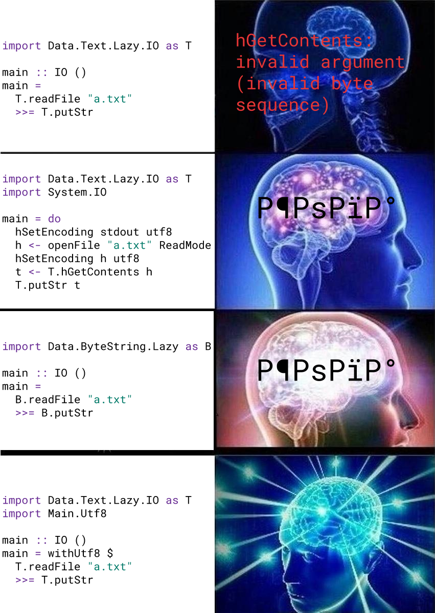

```text
hGetContents: invalid argument (invalid byte sequence)
```

```text
hPutChar: invalid argument (invalid character)
```

```text
commitBuffer: invalid argument (invalid character)
```

Oh no!

Bad news: something is wrong.
Good news: it is not necessarily an issue with your code, it can be one of the
libraries or build tools that you depend on.

Yes, really. Haskell tools you are using every day have a problem that
can cause this confusing error to show up. Here is a (definitely incomplete)
list of projects still affected:

* [Haddock][issue:haddock]
* Hedgehog
* tasty-discover

And these are the projects where it was, hopefully, fixed:

* [GHC][issue:ghc] (Yes! Even GHC itself!)
* [stack][pr:stack]
* [hpack][pr:hpack]
* [hlint][issue:hlint]
* [stylish-haskell][issue:stylish-haskell]
* [haskell-ide-engine][issue:hie]
* [markdown-unlit][issue:md-unlit]

This is to announce that we have published a **new Haskell library
called [`with-utf8`]** and we hope that it will help solve this kind
of problems once and for all.
You can find everything you need to start using it in your projects
in its documentation on Hackage, while this post offers a slightly
more detailed explanation of what is going on and the reasoning
behind some of the design decisions we made.

What we all can do is raise awareness, and from now on try our best
to write Haskell programs (and especially Haskell tooling) that
will work correctly on the first try.
For this, we only need to:

1. Understand the root cause.
2. Develop a universal mitigation strategy.

## Why it happens

### Unicode is easy

People speak many different languages and languages use different alphabets.
To be able to work with characters from all these alphabets, people invented
[Unicode]. Unicode is basically a huge collection (_repertoire_) of all characters
present in all alphabets that ever existed and then some more.

Most modern programming languages have their `Char` (or equivalent) type support
the full range of Unicode, and [Haskell is not an exception][report:charstr].
This is a great thing, as it means that your program that greets the user will
be equally happy to greet a John, an Иван, and a たろう:

```haskell
main :: IO ()
main = putStrLn "Name: " *> getLine >>= putStrLn . ("Hello, " <>)
```

```text
$ ./greet
Name:
Кирилл
Hello, Кирилл
```

### Character encodings are hard

As a software developer, you know that everything in the computer is made of
zeroes and ones, therefore there needs to be a way to represent this enormous
repertoire of characters as sequences of bytes.
This is what a _character encoding_ (aka “character set”, aka “code page”) does.

Back in the day people used encodings such as [latin1], [cp1256], and [koi8-r].
The weird thing about these is that each of them supports only a subset of whole
Unicode, and, for some reason, for a long time everyone was OK with that (well,
to be fair, Unicode did not yet exist back then, and the Internet was not very
popular). There is no place for anything like that in the 21st century.

Nowadays we have [UTF-8], which can encode all of Unicode, and we also have
[UTF-16] and [UTF-32]... Wait, what? Excuse me, why are there three
(actually, five) of them? The short answer is: UTF-32 (being a fixed-length
encoding) can be useful in rare algorithms where you need constant-time access
to individual characters, and [UTF-16 was a mistake][utf8everywhere].

### The problem with text

While you are in the world of your high-level programming language,
you’ve got this nice abstraction where strings are just sequences of chars,
and chars are, you know, just characters, things you can compare to each other,
call `toUpper` on, stuff like that.

However, the usefulness of your programs comes from the fact that
they communicate with the external world: they get data from `stdin`,
files, network sockets, do some processing and then write the answer back.
And it is exactly at this border with the real world where
truly scary things start to happen.

For historical reasons, operating systems do not provide an abstraction for
human-readable text, and thus they always give your program raw bytes
and expect raw bytes in response: bytes come from the user’s terminal,
bytes are stored in the file system, bytes travel over the network.
This is perfectly fine most of the time as your programs work with
binary formats and protocols anyway.

But sometimes you might encounter just _text_. The two most prolific examples
are:

1. files that contain source code and
2. console input/output.

In order to turn bytes into text and vice versa, one needs to know
which character encoding to use. You probably don’t think about this too
often, do you? You just call `putStrLn` or `hGetContents`
and let your language handle this.
But, hold on a second... really, which encoding will it use?
As you have probably guessed already, the answer is not “always UTF-8” –
otherwise I wouldn’t be writing this and you wouldn’t be reading it.

### Haskell defaults

In Haskell, every file handle has an encoding associated with it;
you can query it using `hGetEncoding`, and change using `hSetEncoding`
from `System.IO`. If you don’t explicitly set it though,
it gets initialised with an encoding derived from the current
locale configured in the operating system.

On Linux, the default locale is determined by the `LC_*` environment libraries,
the ones that the `locale` command outputs. You can see this with
the help of a tiny Haskell program:

```haskell
import GHC.IO.Encoding (getLocaleEncoding)

main :: IO ()
main = getLocaleEncoding >>= print
```

Save it as `encoding.hs`, compile, and run:

```text
$ ./encoding
UTF-8

$ LANG=C ./encoding
ASCII

$ LANG=ru_RU.koi8r ./encoding
KOI8-R
```

This behaviour certainly seems to make sense.
However, I can think of another behaviour that would make sense too:
just always use UTF-8, right? In order to decide which one is better,
we’ll have to dive into specific use-cases.

#### A text file

As I said, most protocols and file formats do a good job specifying
how exactly the bytes should be interpreted, however there is one
pretty wide-spread file format that does not: _plain-text_.

When you see a plain-text file, there is no way for you to know
what encoding it uses. In fact, if you come from a non-English-speaking
country, chances are, you are old enough to remember trying a bunch of
different encodings in your text editor when opening a file until one of
them happens to work.

Indeed, as a person using a text editor to write down some thoughts, you
don’t really care what exact encoding your text editor uses as long as it
uses it consistently (that is, you can close the file, open it later,
and it will be readable). And you probably want to be able to open the
file with a different editor. As long as all your editors are using the same
encoding, for example, the one specified in your system locale, everything
will be good.

Oh, wait. It’s 2020. Maybe you also want _others_ to be able to read your
files, even if they live in countries different from yours. Now it is
starting to look like always using UTF-8, even if you or your friend
have some weird locale configured, might be a better choice.
Luckily, nowadays UTF-8 _is_ the de facto standard for text files, so if
you see a text file that has been created in the past 10 years or so, it
is almost certainly encoded in UTF-8.

Everything above applies to source code as well.
Except that specifications of some languages actually restrict the set
of characters valid in source code to ASCII, which have the unique property
that they are encoded by the same sequences of bytes in almost all existing
encodings (including UTF-8), so you can decode such a file using almost
any encoding and the result will be the same. Some other specifications
explicitly say that source code must be encoded in UTF-8.
But we are talking Haskell here, and, surprisingly, the Language Report
only says that [the syntax uses Unicode][report:unicode], but does not
mention any encodings at all, leaving it all to the compilers.

Well, our favourite Haskell compiler – GHC – [assumes source files are
encoded in UTF-8][ghc:utf8]. Well, strictly speaking, it truly ignores
comments, which are allowed to contain sequences invalid in UTF-8, but
thinking about someone using this “feature” gives me chills.

Bottom line: in year 2020, all text files should be decoded as UTF-8,
especially those that contain source code,
especially those that contain Haskell source code.
And the user’s locale is not relevant at all.

#### The console

Working with the console is similar to working with a file: your program
can write some _text_ to a special handle and the operating system will
relay it to the user’s terminal. Whatever the user types in their terminal
you can read from another special handle.

The important difference with text files is that the
text shown on a terminal is meant to communicate some information and then
disappear forever. For this reason, it is not very important what encoding
it uses.

However, there is a complication: there is another program involved in the
process of using the console – it is the user’s terminal emulator, the
graphical application that actually renders the console on the screen.
In order to pick the right symbols from the font, it needs to know how
to decode the bytes coming from your program through the OS into
human-readable text. For this, it needs to know which encoding to use.

This encoding is configured somewhere in the settings of your terminal emulator.
You probably knew about this configuration option, but you have long
forgotten about its existence, and rightfully so, as most you will
never need to use, as it is already set to the most universal value of
all: UTF-8.

The problem here is that if you blindly output UTF-8 to the user’s terminal
and it was configured to use a different encoding for some reason,
you might end up getting some жопа or screwing the terminal entirely.
The safest assumption to make is that the terminal emulator uses the same
encoding as the locale of the operating system (well, otherwise it would
be hard for the user to even read localised messages from standard system
utilities).

What to do, though, if you really want to output a character that is
not encodable in the locale’s encoding and, thus, impossible to render
on the screen? Unfortunately, your only choice is to replace it with
something else.

This restriction is especially hard on software development tools,
since, even if they correctly set the encoding on files they read and
write, they still need to worry about the characters that they show
on the screen. In fact, GHC itself was [bitten exactly by this][issue:ghc]:
it did a good job reading source files as UTF-8 regardless of the locale,
but if there was a type-checking error in a definition whose name was
unrepresentable in the locale’s encoding, it would crash trying to
display the error on the screen.

Oh, by the way, exactly this problem is still present in Haddock and you
now know enough to make it crash on Linux. Save this file:

```haskell
module Hahahaddock where

domaĝo :: String
domaĝo = "pity"
```

and run `haddock` on it with `LANG=C`. It will crash trying to say the name
of the definition that is missing documentation.

### Non-UTF-8 locales

Why would your program ever be used on a system with a locale that uses an
encoding that is not UTF-8?

Well, the simplest thing you can do is to give your program to a Windows user.
You’ll be surprised how hard Microsoft is trying not to do the right thing
and simply use UTF-8 everywhere (well, if you followed the link to
[UTF-8 Everywhere][utf8everywhere] above, then you would’t be surprised at
this point). There are still a lot of Windows installations that use
various esoteric character encodings (or “code pages” as they call them).
That is the reason why a lot of the encoding-related issues are reported
by Windows users, and that’s actually great, because it helps solve the problem.
Unfortunately, sometimes the solutions are not well-thought-out, such as
[this fix][tasty-discover:fix] to a real problem affecting everyone,
bashfully hidden behind `#if defined(mingw32_HOST_OS)` for no good reason
at all.

Another reason to unset the locale to `C` is reproducible builds. That is
why another source of encoding-related bug reports is [Nix] users. Current
locale settings can affect the build process in subtle ways, such as
change the format of dates or the [sorting order for strings][locale:sort].
It’s just weird to think that a build tool may output different results
depending on the locale of the system it is used on, so people
preparing builds for others prefer not to give it even a chance and change
locale to the most universal and simple one – `C`. Sadly, this has a
consequence of changing the locale encoding to ASCII. Even more sadly,
there does not exist a standardised locale which would behave like `C` but
have `UTF-8` as its default encoding.
[Debian’s `C.UTF-8`][locale:c-utf8] is one attempt at standardising this,
but it is not yet as widespread as it should be.


## Better defaults

I hope you can agree now that the defaults chosen by GHC are not
optimal, as evidenced by the plague of encoding-related issues
in the Haskell world.
Here is a more reliable strategy.

### Text files always in UTF-8

Whenever your program opens a text file, in 99.9% of all cases
you really want it to be treated as UTF-8. Calling `hSetEncoding`
on every file after opening is not very convenient. Luckily,
there is an easier way.

As you remember, GHC creates new file handles with the encoding taken
from `getLocaleEncoding`. All we have to do is call `setLocaleEncoding utf8`!
Now all files opened in text mode will automatically use UTF-8, and you
can still change it to something else on individual files if you really need
to. Of course, this is only a good idea in your own executable; if you
are creating a library, changing program-global defaults is a no-no.

### Unknown handles require caution

If your library function accepts a handle as an argument and then
writes to it, it is very likely that you expect this handle to be a
file handle rather than a terminal device (unless, of course, you are developing
a library that is directly related to showing information to the user
on their screen, such as a CLI toolkit).

In this case, you want to make sure the encoding is UTF-8, however, if
for some reason it happens so that the handle _is_ connected to a
terminal, you are in trouble because you never want to change the
encoding of text shown on the screen by the terminal emulator.
Luckily, you can use `hIsTerminalDevice` to detect this situation.

What do you do if it is a terminal device? Well, you have to replace
all unencodable characters with something else. I have good news again:
you will not need to change your function at all – the `iconv` library that
GHC uses under the hood has you covered and it can approximate
(aka transliterate) those bad characters for you. All you have to do
is change the encoding of the handle to a newly created one, which you
make by taking the name of the old encoding and appending `//TRANSLIT`
to it.

### Keep standard handles intact

The three standard handles – `stdin`, `stdout`, and `stderr` – are
normally used for interacting with the user. When they are attached
to a terminal, there is no question, you have to transliterate them.
But what if, say, `stdout` is _not_ attached to a terminal?
This situation is tricky, and you will have to guess what the user
wants to do with the output of your program.

If the output of your program is informational and
only useful for a short period of time,
then you probably don’t want to try to encode it in UTF-8.
The reason is simple: if the user pipes the output through something
like `grep`, your `stdout` will not be connected to a terminal, but
the output will end up on the terminal anyway.`

On the other hand, if your program is meant to process text files
and supports printing the resulting new file to standard output,
then you _do_ want to encode it in UTF-8, as long as the standard
output is not connected to a terminal but rather redirected to a file.
In this case, you can just treat the standard handle as any other
unknown handle passed to your code from somewhere else.


## `with-utf8`

All of the above is implemented in [`with-utf8`].

I invite you to take a look at its Hackage documentation, but to
quickly sum it up:

* The `withUtf8` function is a wrapper around your `main` that will
  call `setLocaleEncoding` and reconfigure standard descriptors
  so that they don’t cause a runtime error no matter what you
  write in them.
* If you can’t change the program-global locale encoding,
  there is `Utf8.withFile` (and `Utf8.openFile`) that will
  set the encoding on the file it opens to UTF-8.
* If you have to work with a handle of an unknown origin and
  you expect it to be a file, you can call `Utf8.withHandle`
  to temporarily switch it to UTF-8 if it is safe to do so,
  or enable approximation otherwise.
* If you have to work with a handle of an unknown origin and
  you are reasonably sure that it is supposed to be a terminal,
  use `Utf8.withTerminalHandle` to only enable approximation,
  regardless of whether it points to a terminal or not.
* There are also `Utf8.readFile` and `Utf8.writeFile`, just
  in case you need them.

<p align="center">
  
</p>


Please, consider using UTF-8 and [`with-utf8`] in your next project,
update your old projects, re-export it from your custom prelude,
send a link to [UTF-8 Everywhere][utf8everywhere] and
this blog post to your colleagues and friends, report and fix
encoding-related bugs in Haskell tools that you are using.
Together we can defeat invalid argument (invalid byte sequence)!


## Further reading

* [The Absolute Minimum Every Software Developer Absolutely, Positively Must Know About Unicode and Character Sets (No Excuses!)][read:joel]
* [Beware of readFile][read:snoyman]


[issue:haddock]: https://github.com/haskell/haddock/issues/573
[issue:ghc]: https://gitlab.haskell.org/ghc/ghc/issues/6037
[pr:stack]: https://github.com/commercialhaskell/stack/pull/2867
[pr:hpack]: https://github.com/sol/hpack/pull/142
[issue:hlint]: https://github.com/ndmitchell/hlint/issues/96
[issue:stylish-haskell]: https://github.com/jaspervdj/stylish-haskell/issues/108
[issue:hie]: https://github.com/haskell/haskell-ide-engine/issues/1560
[issue:md-unlit]: https://github.com/sol/markdown-unlit/issues/8

[tasty-discover:fix]: https://git.coop/decentral1se/tasty-discover/blob/1c24f455d314ac969326252b0052af8c3a046496/library/Test/Tasty/Discover.hs#L89

[Unicode]: https://unicode.org/
[report:charstr]: https://www.haskell.org/onlinereport/haskell2010/haskellch6.html#x13-1190006.1.2
[report:unicode]: https://www.haskell.org/onlinereport/haskell2010/haskellch2.html#x7-140002
[ghc:utf8]: https://downloads.haskell.org/~ghc/latest/docs/html/users_guide/separate_compilation.html#haskell-source-files

[latin1]: https://en.wikipedia.org/wiki/ISO/IEC_8859-1
[cp1256]: https://en.wikipedia.org/wiki/Windows-1256
[koi8-r]: https://en.wikipedia.org/wiki/KOI8-R
[UTF-8]: https://en.wikipedia.org/wiki/UTF-8
[UTF-16]: https://en.wikipedia.org/wiki/UTF-16
[UTF-32]: https://en.wikipedia.org/wiki/UTF-32

[utf8everywhere]: https://utf8everywhere.org/
[Nix]: https://nixos.org/nix

[locale:sort]: https://unix.stackexchange.com/q/252419/41777
[locale:c-utf8]: https://manpages.debian.org/unstable/open-infrastructure-locales-c.utf-8/locales-c.utf-8.7.en.html

[`with-utf8`]: https://hackage.haskell.org/package/with-utf8

[read:joel]: https://www.joelonsoftware.com/2003/10/08/the-absolute-minimum-every-software-developer-absolutely-positively-must-know-about-unicode-and-character-sets-no-excuses/
[read:snoyman]: https://www.snoyman.com/blog/2016/12/beware-of-readfile
