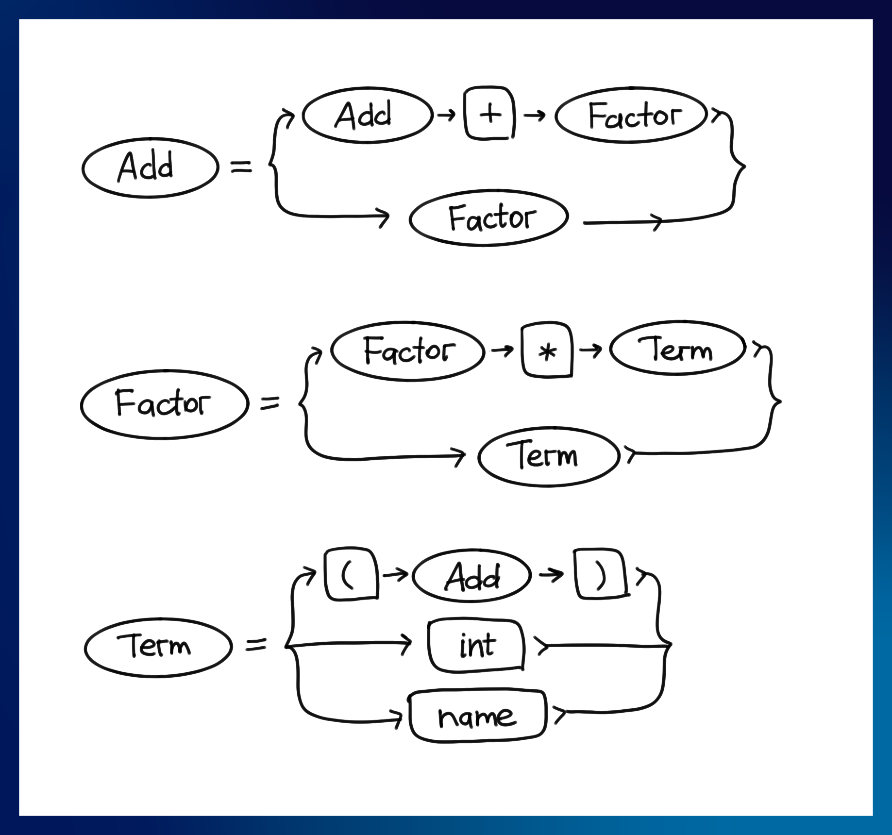
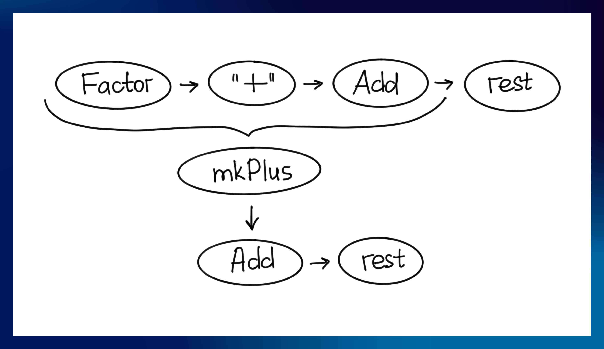
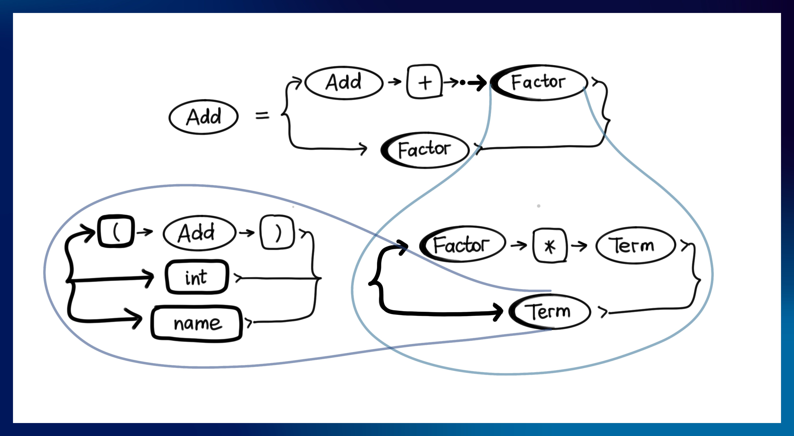

# How to Implement an LR(1) Parser

Sooner or later, you'll try to write yourself a programming language. And one of the first parts will most probably be a parser.

There are two major groups of parsing methods:
1) Recursive descent: LL (including parser combinators/packrat), PEG.
2) Recursive ascent: LALR(1), LR(1), etc.

The methods of descent are the easier ones, but they have problems:

1) **No [left recursion](https://en.wikipedia.org/wiki/Left_recursion).** If your grammar has non-trivial left-recursive parts you'll spend a lot of time rearranging them.
2) **No conflict resolution.** If two of your conflicting rules are able to parse the same input, the left one in `left / right` will win (where `/` is a left-biased choice operator). In short, it will implicitly choose which side wins.
3) **Backtracks.** Not only will they cause the same text to be parsed twice, but if your parsing library/generator doesn't disable backtrack by default – like the `parsec` library does by giving you the `try` combinator to selectively turn it on – you might end with exponential parsing time for some input texts.
4) **Time complexity.** Making a parser exponential in time constraints is easier than you think, actually.

The ascent methods:

0) An algorithm of a general implementation is written by Knuth.
1) Accepts left and right recursion.
2) LR(1) _finds_ [conflicts](https://en.wikipedia.org/wiki/LR_parser#Conflicts_in_the_constructed_tables) and displays them.
4) Works for guaranteed linear time.
5) _Never_ backtracks.

This is my view, biased from using LL in form of parser combinators all the time. Descent methods have their plus sides, as well. Feel free to use whatever parsing method you like!

The problem with LR is that it appears complex and mysterious, and if you open [the original Knuth's paper](https://www.sciencedirect.com/science/article/pii/S0019995865904262) – you will say "nope!" almost immediately.

I this article, I will attempt to explain the LR(1) table parsing algorithm, so you can follow and implement it yourself, and not be limited to using generators like `yacc`, `menhir` or `happy`.

I also think that implementations of all important algorithms should be rewritten once in a human generation so that the toolchain never becomes inaccessible and the code remains adapted to current standards.

## Grammar

Each serious parser nowadays starts with a grammar of some form – as do `yacc`, `Menhir`, `ANTLR` or `happy`.

I will use slightly modified [Backus-Naur form](https://en.wikipedia.org/wiki/Backus%E2%80%93Naur_form) (or BNF) to represent the grammar.

Our algorithm will assume that a lexer was already run and produced a stream of labelled tokens for us to consume.

Let's describe the classic grammar that everybody knows: arithmetics.



I will use the following conventions:

1) Capital words – `Add`, `Factor`, `Term` are nonterminals, or constructs.
2) Small-letter words – `name`, `int` are terminals, the definitions of which are omitted.
3) Double-quoted words – `"("`, `"+"` are terminals with a fixed shape.
4) The code on the right of `->` is a semantic action that is used to build the AST node out of rule components when the rule is parsed to the end. We will only need them once, so I will omit them for clarity till that point.

This is our grammar:

```ebnf
Start  = Add              -> id
Add    = Add "+" Factor   -> mkPlus
       | Factor           -> id
Factor = Factor "*" Term  -> mkMult
       | Term             -> id
Term   = "(" Add ")"      -> nth 1
       | name             -> mkName
       | int              -> mkInt
```

I will disallow the use of Kleene star (`*`), Kleene plus (`+`), optionality operators (`?`), and the choice operator (`|`) outside of the root of the rule. The grammar containing them can be reduced to this "normal form" almost mechanically.

I will disallow any rule to match empty string and will assume no rule does. This will make some parts of the algorithm a lot easier to make.

I will also use a slightly different form of this grammar:

```ebnf
Start  = Add

Add    = Add "+" Factor
Add    = Factor

Factor = Factor "*" Term
Factor = Term

Term   = "(" Add ")"
Term   = name
Term   = int
```

This form removes the `|` operator entirely while otherwise preserving the semantics of the grammar.

I will call _a point_ any singular terminal or nonterminal.

I will also use the terms _map_ and _function_ interchangeably. Most programming languages provide ways to turn one into another (memoization).

## Some insights about the algorithm

### Pushdown

We will make a _pushdown automata_ – which means we'll have a stack or two where we will collect partial trees and run semantic actions over them. In some sense, the stack can be seen as a state of _depth-first traversal with a spine_ of the resulting tree.



For instance, we can have a stack:
```haskell
Factor : "+" : Add : ...rest
```
and when the next input is `"*"`, we push it as well.

On some other input, we might instead choose to pop `Factor`, `"*"`, and `Add` from a stack, invoke `mkPlus` on them, and then push the result back, ending with a stack that looks like this:

```haskell
Add : ...rest
```

### Notion of nonterminal

I like to view nonterminals as sets (or classes) of their possible implementations – or matchable terminal sequences. For instance, `a * 42` is a member of `Factor` set because it can be parsed using `Factor` as the starting nonterminal.

In addition to that, nonterminals can be viewed as ways to insert parenthesis into the text: `b + a * 42` -> `b + [a * 42]` – here we recognise the `a * 42` as a `Factor`.

What I want the reader to notice is that nonterminals don't add anything to the part of the text they group. They are completely transparent, so you can replace a reference to any of them in the grammar with their bodies, and that will not change anything. Just remember that the entire body with all the alternatives should be inserted (and the result needs to be converted to normal form again).

The intention of this paragraph is that it might "click" for you while reading further.

## Transitive closure

Before we move any further, we need to discuss a mechanism that will make implementation of almost all parts close to trivial.

The transitive closure of a function is its fixed point, which it will reach after being applied enough times to the seed.

More formally, the transitive closure of some function `f` (over some seed `x`) is an expression `f (f (f (... (f x) ...)))`. Of course, that expression would be infinite.

The simplest way to make a practical transitive closure is to apply `f` to some accumulator `x` until it stops to change.

If, let's say, `f` stops changing after 2 invocations, so the `f (f x)` is the same as `f (f (f x))`. By induction, it will be the same as `f (f (f (... (f x) ...)))`. That means, we can omit the "apply indefinitely" part when we notice that the last call did not add anything new.

Let's see an example in action: for each nonterminal, we will look for a set of terminals that can go immediately after it.

Our grammar, for reference:

```ebnf
Start  = Add             -- can be followed by $

Add    = Add "+" Factor  -- Add can be followed by "+"
Add    = Factor

Factor = Factor "*" Term -- Factor can be followed by "*"
Factor = Term

Term   = "(" Add ")"     -- Add can be followed by ")"
Term   = name
Term   = int
```

Our `accumulator :: NonTerm -> Set<Term>` is `{Start: {$}}`

For each rule group, we make the following productions:

```haskell
{ Start:  {$}
, Add:    {"+", ")", $}
, Factor: {"*"}
, Term:   {}
}
```
The map has changed, so we restart with it as the new accumulator.

Now we get the following:

```haskell
{ Start:  {$}
, Add:    {"+", ")", $}
, Factor: {"*", "+", ")", $} -- because Add ends with Factor
, Term:   {}
}
```

On the next iterations, we get:

```haskell
{ Start:  {$}
, Add:    {"+", ")", $}
, Factor: {"*", "+", ")", $}
, Term:   {"*", "+", ")", $} -- Factor ends with term
}
```

The next iterations will not change the accumulator, and thus we have reached the fixpoint.

As you can see, despite the algorithm not knowing that `Term` can be followed by end-of-text `$` initially, it managed to propagate the information everywhere, nonetheless.

Of course, not each function will do as well as `f` and converge. But all the functions we write for this article will.

This function will solve soooo many problems automatically! Later we will need some recursively-dependent relations, like the one that was used as an example – and if you have this transitive closure, you don't have to worry about the order you calculate that in. Like, at all. The transitive closure will propagate the results for you if you provide it with one step of propagation.

We will use the transitive closure on functions that transform (or, rather, "fill") sets and maps. For readers with a Haskell background, I recommend maps from a package called `monoidal-containers`.

I will also assume you use immutable maps and sets.

<!--
The transitive closure mechanism can be optimised further, providing only new information – or the delta between result of previous step and the accumulator – to the step-function, and merging all deltas to the accumulator as we go. -->

### Plugs and adapters

Of course, our `transClosure` works with functions that do `Set<A> -> Set<A>` or `Map<K, Set<V>> -> Map<K, Set<V>>` transformations. But, for instance, the function `entails :: Position -> Set<Position>` does not fall under any of these categories. In this case, since we have to present a function of type `Set<Position> -> Set<Position>`, we simply apply `entails` over the whole input set and flatten set-of-sets into one set (in Haskell, we simply do `transClosure (foldMap entails))`).

The first `Set<A>` in the `Set<A> -> Set<A>` type is either "the knowledge we have up to this point" or "the _new_ knowledge we have up to this point". The latter is a bit tricky to implement, but it ends with the same result.

We will later work with maps-of-sets and maps-of-maps-of-sets with the same need to calculate a transitive closure of some function. In that case, special care should be taken when merging maps: if both of maps `m1` and `m2` contain the same key `a`, the resulting map should contain `a: m1[a] <> m2[a]`, where `<>` is the merge operation and `m1[a]` is indexing. This applies to Haskell as well unless `monoidal-containers` are used. In that case, the `Monoid` instance will do it for you.

And the adapter will be, again, `foldMap`: we merge all sets in values in the map into one input set, map the function over it, and do deep-merge as described above.

## FIRST table

We will also need 2 auxillary tables: `FIRST` and `FOLLOW`. Here we will build the `FIRST` one.

The function has a type of `FIRST :: NonTerminal -> Set<Terminal>`, and for each nonterminal in the grammar, it will return all the terminals it can start from.

For each rule, we will analyse the first point of it:

1) `R = . a ...rest` – in case like this, we add `{R: {a}}` to our knowledge.
2) `R = . A ...rest` – in this case, we add `{R: FIRST(A)}`.

Of course, there can be rules like:

```ebnf
R = A ... | ...
A = R ... | ...
```

But it is not a show stopper! We will use the transitive closure to overcome this.


We will also use an empty set as our seed for the closure.

The one-step of this operation is simple: we swipe over all rules and react in the way described above on their first item. Then we deep-merge all the maps into one, and this will be added to the knowledge by the closure mechanism.

## FOLLOW table

This thing is a bit trickier. For each nonterminal, we need to construct a set of terminals that can immediately follow that nonterminal, according to the grammar.

This part of the algorithm also uses the `FIRST` table for its construction.

So, for each position of each rule in the grammar, we will look at its locus and the locus of the next position of that rule:

1) `... = ... . R a` – in this case, we add `{R : {a}}` to our knowledge.
2) `... = ... . R A` – here we add `{R : FIRST(A)}`.
3) `A   = ... . R` – the `R` here can be followed with each token the `A` can be, therefore `{R : FOLLOW(A)}`.
4) `... = ... R .` – in this case, no information can be added.

Again, we use the transitive closure the same way we did with `FIRST`. We merge the results of the scan above and use an empty map as a starting seed.

## The position

_The position is also called LR(1)-item in the literature._

In the different stages of parsing, the parsing device will go over the table, moving inside rules left-to-right. We need a way to represent that movement. For that, we will add a new entity: _a parsing position_ (or just _position_).

For instance, there are 4 positions for the rule `Add = Add "+" Factor`:

```ebnf
Add = . Add "+" Factor
Add = Add . "+" Factor
Add = Add "+" . Factor
Add = Add "+" Factor .
```

The _cursor_ `.` depicts the place where the parsing device stands. Everything on the left is assumed to be parsed, everything on the right is going to be parsed. We will call the immediate point after the cursor _a locus_.

Yet, the position itself is not enough to build a parser table. For instance, lets take `Add = Add "+" . Factor`.

If the topmost element of the stack is `Factor`, we can move over it in the position to `Add = Add "+" Factor .`.
If the topmost element is `Term`, that means that while we are still in position of `Add = Add "+" . Factor`, we are parsing the `Factor = . Term` position as well.

It is said that position `Add = Add "+" . Factor` also entails the `Factor = . Term` one – and, transitively, `Term = . name` but not vice versa.

That is because in the `Add = Add "+" . Factor` we can have `name`, `int` and `"("` as valid inputs, and we must be able to handle that, somehow.

We say the position `A = B . C` entails all initial positions of `C` if `C` is a nonterminal. The positions `A = B C .` or `A = B . c` do not entail anything because their loci are nothing or a terminal, accordingly.

The position should also store a set of terminals that can follow its fully parsed version.

The _state_ of the parser will be a transitive closure of such entailment.

## Parsing state



We use the position we start with as a seed for the transitive closure.

We will call the "transitive closure of entailment" a `CLOSURE` in all-caps and monospace font. We will define `CLOSURE` as:

```haskell
CLOSURE :: Position -> State
```

and:

```haskell
type State = Set<Position>
```

The algorithm is as follows.

For each position in the starting set, if its locus contains a terminal or is empty, no new positions are added to the state. If it is a non-terminal, then all starting positions of that terminal are added to the set, _with their lookahead set changed_ to the `FIRST(Next)`, where `Next` is the point that follows the locus in the position. If nothing follows the locus, the the lookahead set becomes `FOLLOW(Entity)` instead, where `Entity` is the output non-terminal of the rule.

If the state ends up with several positions with the same bodies but different lookaheads, they should be merged into one.

For an example, we will take different grammar, where effects of lookahead change are more obvious.

```ebnf
S = a A b
S = a B d
S = c A d
S = c B b
A = x
B = x
```

Our starting set will be:

```haskell
{ S = a . A b {$}
, S = a . B d {$}
}
```

For instance, one step of entailment looks like this:

```haskell
{ S = a . A b {$}
, S = a . B d {$}
, A = . x     {b}
, B = . x     {d}
}
```

The `A` rule now has a lookahead set of `{b}`, because `b` follows in the rule `S = a . A b {$}`. The same logic causes `B` to get a lookahead set of `d`.

The source rules themselves retain the lookahead set they've started with. This applies for all transitive invocations of entailment.

This is what separates LR(1) from SLR and is responsible for the increase in the size of LR(1) tables.

I should also note, that the parsing device exists in all those positions _simultaneously_.

## GOTO table

Yes, "`goto` is considered harmful" – if anyone still remembers what this's about. But we are making a different `GOTO`.

Our `GOTO` is a table that for each state and possible top element of the stack tells us to what state we should go next (in some situations).

We will, again, write how to calculate the 1 step of the transformation, and the transitive closure will do the rest for us.

Our one-step `goesTo :: State -> Map<State, Map<Point, State>>` function should do the following:

For each position in the input state that has a non-empty locus, contents of this locus should lead to the `CLOSURE` of this position, advanced – with the lookup set changed to either the `FIRST(NextNonTerminal)` or the next terminal.

For instance, let's take an arbitrary position inside this rule:

```haskell
Add = Add "+" Factor {"+", ")", $}
```

This one, for instance:

```haskell
{ Add    = Add "+" . Factor  {"+", ")", $}
, Factor = . Factor "*" Term {"*", "+", ")", $}
, Factor = . Term            {"*", "+", ")", $}
, Term   = . "(" Add ")"     {"*", "+", ")", $}
, Term   = . name            {"*", "+", ")", $}
, Term   = . int             {"*", "+", ")", $}
}
```

with

```haskell
"("
```

fires the case
```haskell
Term = "(" . Add ")" {"*", "+", ")", $}
```

leading to state
```haskell
CLOSURE(Term = "(" . Add ")", {"*", "+", ")", $})
```
containing, amongst others, following positions:
``` haskell
{ Add = . Add "+" Factor {")"}
, Add = . Func           {")"}
}
```
_notice that there is only `")"` in the lookup set – in this state it is impossble to have anything else to cause a reduction!_

and with

```haskell
Factor
```
leads to
```haskell
CLOSURE(Factor = Factor . "*" Term)
```

And the `GOTO` function is a transitive closure over `goesTo`, plumbed with enough `foldMap`-s. With the `{ Start = . Whatever {$} }` as the initial state – that's why we have that rule in the first place.

This function will terminate on final positions (like `Add = Add "+" Factor .`) where there's nowhere to go.

But we still can't parse with `GOTO` alone. You might have heard that `LR(1)` is used with words like `shift` or `reduce` – and you're correct. We will now go closer to this part.

The top keyset of `GOTO :: Map<State, Map<Point, State>>` will also function as the set of all possible non-final states, which we will employ in the next block.

## ACTION table

`GOTO` is fine, but we don't have _points_ as input – we have _terminals_. So we need to have some `(State, Terminal) -> Decision` relation. We will also use the `GOTO` function for that.

The `Decision` is one of 2 (3 to 5, actually):

* `Shift (state1)` – push current terminal on the stack and go to `state1`.
* `Reduce (R = A b C . {a b c} -> mkR)` – pop some stuff from the stack, call an `mkR` action over it, push the result into the stack, and return to the state `GOTO(current, R)`.
* `Error` – die horribly telling what terminals were expected at that position.
* `Accept` – will only be used in the `Start = Whatever .` position when the next terminal is the end-of-input one (`$`). Reaching it means we're done.
* `Conflict (dec1, dec2)` – we will use this decision to signify that a conflicting set of outcomes is possible for this grammar. It enables us to please the user with a "you have 48 shift/reduce and 4 reduce/reduce conflicts for this grammar" message.

So, let's return to our beloved example state:

```haskell
{ Add    = Add "+" . Factor   {"+", ")", $}
, Factor = . Factor "*" Term  {"*", "+", ")", $}
, Factor = . Term             {"*", "+", ")", $}
, Term   = . "(" Add ")"      {"*", "+", ")", $}
, Term   = . name             {"*", "+", ")", $}
, Term   = . int              {"*", "+", ")", $}
}
```
We need to search for two kinds of things:

1) The positions like `Term = . name {...}` that expect a terminal.
2) The positions like `Factor = Factor "*" Term . {...lookahead}` that are final ones.

The first set of positions will produce `Shift`-s. For instance, the `"("` terminal will produce the following map for current state:

```haskell
{ currentState =>
  { "(" =>
    Shift (CLOSURE (Term = "(" . Add ")"))
  }
}
```

The second set of positions will produce `Reduce`-s. For each terminal (for instance, "+") that is in the lookahead set of the rule of that position, we generate:

```haskell
{ currentState =>
  { "+" =>
    Reduce (Factor = Factor "*" Term . { mkR } -> mkMult)
  }
}
```

We do this for each state the `GOTO` table has, and then we merge all results into a single map.

### Conflicts

We might end in a situation where two decisions are possible for the same state and input terminal that are different, and none of which is `Error`.

In this case, I recommend marking this cell as a `Conflict (one, another)` and continuing further. Later, when the table is done, we can sweep over it and present all conflicts to the user, if there are any.

### Error reports

It is not very funny when your parser says: `Syntax error.`. We can do better.

The first thing we need is a set of all terminals in our grammar.

For the second part, we need to traverse the `ACTION` table and collect all the `(state, input)` pairs that don't lead to empty cells or `Error`. From those, we construct a map from states to inputs they expect. We will call that map `EXPECTED`.

We will use that map in the parser device.

## Parser

Now we now have all the machinery to construct the parsing device.

It should have two stacks in its state: one for partial program trees (value stack) and another one for the parser states (control stack). The initial state is the `CLOSURE(Start = Whatever . [$])` one.

The parser should also be able to read a stream of inputs, one-by-one, and should have read access to the next unconsumed input.

One subtle thing: the parser accepts a stream of _inputs_, not terminals – the latter ones are _classes_ of inputs (`42` is an input, `int` is a terminal). The lexer (which is outside of the scope of this article) should assign those classes to inputs or produce a stream of `(input, terminal)` pairs.

The parsing loop is as follows:

<ol>
  <li> Read next `token`. </li>
  <li> Take topmost state and the token from (1), lookup `ACTION(state, token)`:
    <ol>
      <li>
        On `Shift (state2)`, push the `token` and the `state2` into corresponding stacks and _remove the token from the input stream_.
      </li>
      <li>
        On `Accept`, exit the cycle and return the top element of the value stack as a parse result.
      </li>
      <li> On `Reduce (R = ...rule -> action)`:
        <ol>
          <li>
            Pop `N` items from both stacks, where `N` is a length of a rule in points.
          </li>
          <li>
            Dispose popped elements from control stack.
          </li>
          <li>
            Apply the semantic `action` from rule to the popped elements of the value stack.
          </li>
          <li>
            Push the result of (3) into value stack and result of `GOTO(currentState, R)` into control stack.
          </li>
        </ol>
      </li>
      <li>
        On `Expected` – produce an error message, using the `EXPECTED(state)` set.
      </li>
    </ol>
  </li>
  <li> Goto (1).</li>
</ol>

## Conclusion

There are still plenty of things to optimise here. For instance, you can shove the states into an array and use their indices instead of the states directly (which will cause you to perform a lookup in a map for a _set_ otherwise).

You can move the calculation of the table to the compile-time and embed the table into the program. The caveat is that tables for LR(1) are usually very big, so using maps instead of non-sparse arrays is recommended.

You can enhance the error reporting by collecting more data from the action table – or by interpreting `N` elements of the parser stacks.

You can also add priorities to the rules so that conflicts can be avoided (or rather, silently resolved) when they end up producing different actions for the same state and terminal.

With this, a basic implementation of LR(1) is done. It will accept left- and right-recursive grammars, autodetect conflicts, and parse text with no backtracks for `O(N)` where `N` is a length of the input.
