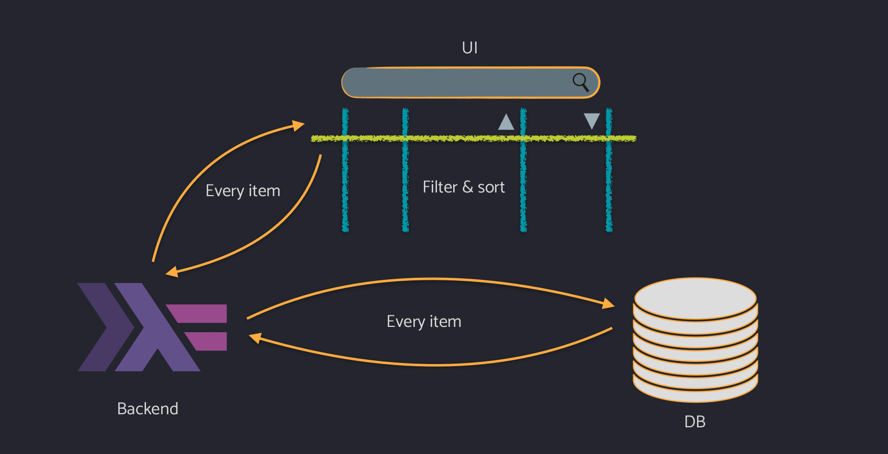
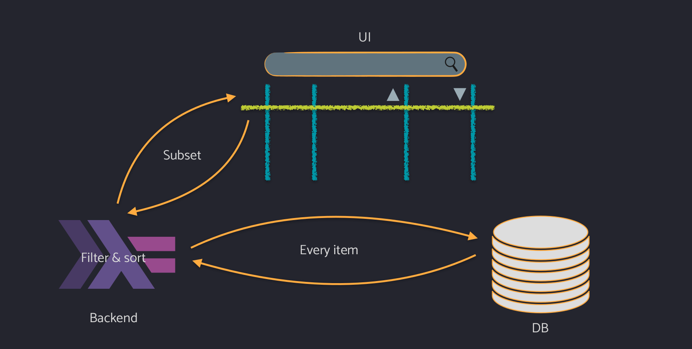
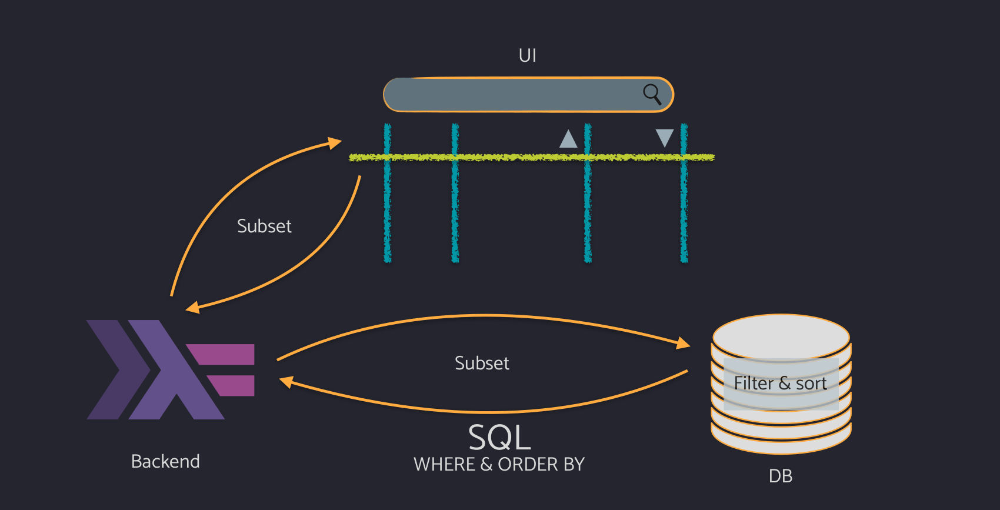
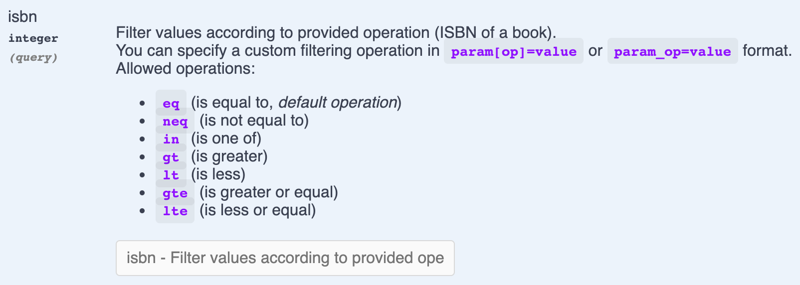
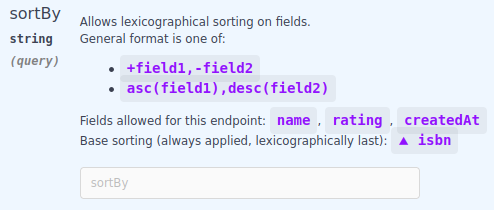
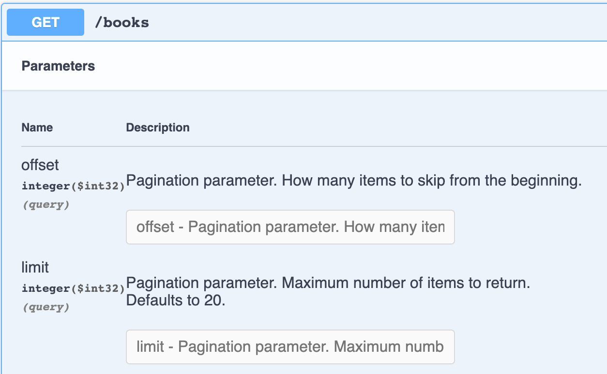

# `servant-util`: extending `servant` with database integration

For backend applications, [the `servant` framework](https://github.com/haskell-servant/servant) is a go in the most cases for us in Serokell.

However, from time to time we find ourselves writing the same boilerplate that, in theory, allows generalization and extraction.
The logic where this boilerplate appears may be not solely about webservers, but also about databases, and so the fact that `servant` does not help us here is justified.
But still, it is convenient to have a library that covers some basic use cases of webserver-database integration.

In this post, we are going to discuss features that would be nice to have and how our new `servant-util` library handles them.

## Overview of `servant`

`servant` is the most popular `Haskell` framework for implementing applications around server-client architecture. It can provide REST API, raw HTML, etc.

When writing our own server, we first write down the type-level description of the API.
As example, let's consider a bookstore API:

```hs
type API
  =    "book" :> Capture "id" Int :> Get '[JSON] Book
  :<|> "book" :> "all" :> Get '[JSON] Book
  :<|> "book" :> ReqBody '[JSON] Book :> Post '[JSON] Result
```

This declares three endpoints.
Routing and any complex structure of our API are handled right in the types.
Types of accepted data and the response should be provided, as well as the serialization method (`JSON` in our case), and that all is handled by `servant` automatically.
The server handler will be only concerned about working with the simple Haskell values like `Book`.

The framework also provides a few other integrations:
* We can generate a client from the `API` type. That will also handle serialization inside.
  The generated client works perfectly with [GHCJS](https://github.com/ghcjs/ghcjs).

 So if the frontend is written in Haskell too (by using [Reflex](https://reflex-frp.org/) or some other framework) we can share the type of API between the frontend code and backend code to query the API, and `servant` will handle all the rest for you.

* OpenAPI 2 and OpenAPI 3 documentation can also be generated from the API.
  Here we will be sure that the documentation remains up-to-date just because it is produced automatically.

Server handlers for the mentioned `API` may look like:

```hs
getBookById :: Int -> Handler Book
getBooks :: Handler [Book]
createBook :: Book -> Handler Result

server :: Server API
server = getBookById
    :<|> getBooks
    :<|> createBook
```

Here, we can see that argument types and the result type for all the handlers are just plain Haskell datatypes.
By default, handlers operate in `Handler` monad, but with `servant`, this is also customizable: we can also use `mtl` or any other approach.

Other built-in `servant` features include:
* GET parameters, response and request headers;
* JSON serialization for requests and responses;
* multiple possible results for a single endpoint (to include, for instance, error responses);
* customization of error responses (for example, for serialization errors);
* streaming.

However, as the topic of this post suggests, there is also a lot of stuff missing:
* database integration;
* metrics (e.g. Prometeus);
* semantic tracing and logging;
* sorting and filtering for bulk requests;
* pagination;
* and others.

So in one of our projects, we needed to implement our own thing that other companies usually don't share, but we decided to share our work.
And so [`servant-util`](https://hackage.haskell.org/package/servant-util) package was born.

The rest of the post is a quick tour over this library, featuring some examples of what can it do.

## Introducing servant-util

To showcase this, we will be working on a simple example: some web application, in its UI we will display a table of some items, that can be goods in the shop, books in a library, films in a database, etc.
UI is pretty standard – there is a way to sort on some columns (indicated by triangled on the picture).
Users also usually have a search field to filter items by name and pagination controls to traverse the entire list of items.

To display that data, the UI must get it from somewhere, and in our case, it is provided by a Haskell backend written with `servant`.
But backend does not itself contain this data, so it goes to the database to obtain the data.
This is a well-known structure of any web application.

And the actual filtering, sorting, and pagination must happen somewhere.

The easiest solution would be to tell your frontend colleague: well, just do it on your side.
We will provide you with all the items from the database, and you will do any necessary processing.



Indeed, this is the most straightforward approach and the most wrong one because we will transfer too much data between the backend and UI.

A more proper solution would be to filter in the backend and send only a subset of data to UI.



However, fetching all the items from the database is still too much of a burden for the network between the backend and the database and the backend code itself.

The most proper solution in 99% of all cases would be to filter, sort, and paginate using the built-in database features.
This way, both UI and backend operate only with a subset of the data.



However, remember that it is actually the user who controls filtering and sorting to perform, and we need to propagate the user's criteria for filtering and sorting to the database.
And we need to communicate this data twice – first from the UI to the backend, and then from the backend to the database.

The second part is easy – communicating filtering and sorting parameters to the database usually can be done via query commands like `WHERE` and `ORDER BY`.

However, there is no standardized protocol to perform this communication between the UI and the backend.
And, unfortunately, every web developer out there who is faced with this problem has to invent their own combinators, their own language of queries understandable by their server.

We've searched for the most commonly used patterns in the world and built our library to support these most common patterns and look like some of the API methods we have met in the world.

## Sorting

Suppose that our API has this `Book` type with 3 fields:

```hs
data Book = Book
  { isbn :: Isbn
  , bookName :: Text
  , author :: Text
  , year :: Int
  }
```

And a simple route that fetches all the books from the service:

```hs
type GetBooks
  =  "books"
  :> Get '[JSON] [Book]
```

This route provides a `GET` method that returns a list of books serialized as `JSON`.
And we would like to extend this route with get parameters to specify what to filter and sort on.

What are our requirements?
* Sort by `isbn` (ascending) by default.
* Allow the user to sort on any field.

The default sorting is necessary for a deterministic result. We don't want to get the list in some random order produced by the database.

For such purpose, `servant-util` provides a combinator called `SortingParams`. So we can extend our API like this:

```hs
type GetBooks
  =  "books"
  :> SortingParams
      '["isbn" ?: Isbn, "name" ?: Text, "author" ?: Text, "year" ?: Int]
      '["isbn" ?: 'Asc Isbn]
  :> Get '[JSON] [Book]
```

This added `SortingParams` accepts two type-level lists:
1. Fields the user can sort on.
2. Fields that participate in base sorting, which will be applied lexicographically last in either case.

We add this parameter at type level because we want it to be documented, affect generated clients, etc.

Which queries our `GetBooks` route can now accept?
Some examples:

* `GET /books` – just returns everything, no sorting except for the default `isbn` one will be applied.
* `GET /books?sortBy=asc(name)` – specifies sorting by name is ascending order. In case there are two books with the same name, they will be sorted by `isbn`.
* `GET /books?sortBy=asc(name),desc(author)` – sorts first by name in ascending order, then by author in descending order.
* `GET /books?sortBy=+name,-author` – an alternative syntax for the query above. You can pick the syntax depending on your aesthetics or on which characters can appear in field names.

In our opinion, this API is enough for most use cases.
Now let's take a look at how to implement a handler for this API.

`SortingParams` combinator makes the handler accept a respective `SortingSpec` argument that keeps what sorting the user asks us to perform.
Inside this `SortingSpec` looks roughly like

```hs
newtype SortingParams provided base = SortingParams [SortingItem]

data SortingItem = SortingItem
  { siName :: Text           -- ^ field name
  , siOrder :: SortingOrder  -- ^ order to sort by
  }

data SortingOrder
  = Descendant
  | Ascendant
```

Later this specification can be used for
* applying sorting manually at the backend level;
* translating the specification to SQL;
* generating data (e.g. for a mock server).

In our case, we want to use SQL queries. If we use `beam-postgresql` to write our queries, our handler will look like this:

```hs
import Data.Beam.Query (all_, select, runSelectReturningList)
import Servant.Util.Beam.Postgres (fieldSort, sortBy_)

getBooks
  :: SortingSpec [...] [...]
  -> Handler [Book]
getBooks sortingSpec = do
  runSelectReturningList . select $
    sortBy_ sortingSpec sortingApp $  -- (A)
    all_ (books booksDB)
  where
    sortingApp Book{..} =  -- (B)
      fieldSort @"isbn" isbn .*.
      fieldSort @"name" bookName .*.
      fieldSort @"author" author .*.
      HNil
```

Here in `(A)`, we use `sortBy_` function provided by the adjacent `servant-util-beam-pg` package to add the necessary sorting.
This will translate the user-provided sorting specification to the necessary `ORDER BY` SQL query.

In `(B)`, we define `sortingApp` that declares how sorting provided by the user must be applied to our database model.
Here we associate the fields as they appear in our API with fields in our database.

`sortingApp` here will have `SortingApp BeamSortingBackend ["isbn" ?: Isbn, ...]` type and will check that the association is correct.
If some field name is wrong or types in API and in the database model mismatch, we will get a compile-time error.

With this code, if the user provides us with `sortBy=+name,-author` parameter, we will submit the following SQL query to the database:

```sql
SELECT * FROM books
ORDER BY name ASC, author DESC
```

So to recap:
* `servant-util` defines query format for the GET sorting parameter.
* This format is parsed to Sorting Spec.
* Handler may use the spec directly or translate to SQL.
* We provide `servant-util-beam-pg` with Beam integration.
* Reasonable OpenAPI documentation and client handlers can be generated automatically.

In case you don't want to use Beam, you can always declare your own database backend and provide the necessary typeclass instances to implement sorting.

## Filtering

Having just sorting is always not enough for the UI in question, and we also have to support filtering.

The users may want to:
* filter by exact ISBN;
* filter by a range of years;
* filter by name substring;
* filter by pattern.

To support this, `servant-util` provides the dedicated `FilteringParams` combinator, so we can write:

```hs
type GetBooks
  =  FilteringParams
       [ "isbn" ?: 'AutoFilter Isbn
       , "name" ?: 'AutoFilter Text
       , "year" ?: 'AutoFilter Int
       ]
  :> Get '[JSON] [Books]
```

In `FilteringParams`, we list field names that we allow to filter by and the corresponding types.

`'AutoFilter` designates that the user is allowed to provide multiple filtering operations for the given field, and they will be automatically supported.
The exact list of allowed filtering operations is specified on a per-type basis.
For instance, if we want to allow exact matches and comparison operations for `Isbn`, we will write:

```hs
type instance SupportedFilters Isbn = '[FilterMatching, FilterComparing]
```

Now let's explore what kind of filters we can create.


#### FilterMatching

The most basic filter that is usually provided.

* `GET /books?isbn=12345` – gets a book with the given ISBN.
* `GET /books?isbn[neq]=12345` – gets all books except for the one with given ISBN.
* `GET /books?isbn[in]=[123,456,789]` – gets books with the provided ISBN values.

#### FilterComparing

Numerical fields usually support comparing operations.

* `GET /books?year[gt]=1990` – gets books after `1990`.
* `GET /books?year[gte]=1994&year[lte]=2007` – gets books from the `[1994..2007]` range.

#### FilterLike

Textual filters.

* `GET /books?author[like]=Alexander*` – does a simple regex-like match on the author.
* `GET /books?author[contains]=sweet` – does a simple substring match.

#### ManualFilter

As opposed to `'AutoFilter`, `'ManualFilter` provides no automatic logic. Instead, it allows the user to pass a value and the backend to supply an arbitrary matching logic for it.


Of course, it is possible to define custom filters.
Note that the list of supported filters for basic types like `Text` or `Int` is hardcoded by the library and cannot be extended to include custom filter operations.
But in the case of `servant`, it is a good practice to define custom datatypes and newtype wrappers for all types (at least for the sake of neater generated documentation). In such cases, any necessary filters can be defined for the API types.

Like with sorting, for filtering we also provide an integration with the `beam` package.
We provide a combinator called `matches_` (A) that is compatible with `beam`'s standard combinator `guard_`.

```hs
import Database.Beam.Query (all_, guard_, select, runSelectReturningList)
import Servant.Util.Beam.Postgres (matches_)

getBooks
  :: FilteringSpec [...]
  -> Handler [Book]
getBooks filterSpec = do
  runSelectReturningList . select $
    guard_ (matches_ filterSpec filterApp) $  -- (A)
    all_ (books booksDB)
  where
  filterApp Book{..} =  -- (B)
    filterOn @"isbn" isbn .*.
    filterOn @"name" bookName .*.
    HNil
```

Here we supply the`filterSpec` that we get from the user and construct a `filterApp` (B) that describes how to apply our filter to the concrete datatype, which is stored in the database.

## Pagination

The last important part is pagination.

For it, we provide a simple combinator called `PaginationParams`.

```hs
type GetBooks
  =  PaginationParams (DefPageSize 20)
  :> Get '[JSON] [Book]
```

It contains the default page size – if the page size is not specified by the user, we display only `20` items at once.

The handler will accept – as one can guess – `PaginationSpec` argument, that internally looks just like:

```hs
data PaginationSpec = PaginationSpec
  { psOffset :: Natural
  , psLimit :: Maybe (Positive Natural)
  }
```

So it represents well-known offset-limit pagination, which has its own drawbacks but in basic cases can be used safely.

As expected, with `PaginationParams` the server API starts accepting `offset` and `limit` query parameters, for instance:
* `GET /books?offset=40&limit=20`.


## Client generation

One can also generate client handlers to construct queries to a server with books API.
For this you use the standard `client` function from `servant-client`:

```hs
getBooks :: ClientM GetBooks
getBooks = client (Proxy @GetBooks)
-- getBooks
--   :: SortingSpec
--        ["isbn" ?: Isbn, "name" ?: Text, "author" ?: Text]
--       '["isbn" ?: Isbn]
--   -> FilteringSpec
--        [ "isbn" ?: 'AutoFilter Isbn, "year" ?: 'AutoFilter Int,
--        , "name" ?: 'AutoFilter Text, "author" ?: 'AutoFilter Text
--        ]
--   -> PaginationSpec
--   -> ClientM [Book]
```

So by the API type, we obtain a `getBooks` function to perform a query in the monad `ClientM`.
This `ClientM` is standard servant client stuff. It basically carries the coordinates of the server and some querying options.

`SortingSpec` and other specifications can be constructed with the dedicated smart constructors. e.g. we can write:

```hs
foo :: ClientM Int
foo = do
  books <- getBooks sortingSpec filterSpec paginationSpec
  return books
  where
    sortingSpec = mkSortingSpec [asc #name, desc #author]
    filterSpec = mkFilteringSpec [#year ?/>= 1994, #year ?/<= 2007]
    paginationSpec = skipping 30 $ itemsOnPage 10
```

Here `mkSortingSpec` and `mkFilteringSpec` are just aliases for `fromList`.
When writing many scenarios, the best experience is achieved with `OverloadedLists` enabled in the module.

We use the `asc` and `desc` combinators to specify sorting order and `?/`-like operators to construct filters.
Hash sign notation, like `#year`, means that the names are lifted to type-level for further type-level checks.

Any mistake in a field name, as well as in a filter operation, will cause a compilation error.
Types of values supplied to filters are inferred automatically, so we don't need to manually specify the types like `1994 :: Int`.


## Swagger

The library also supports the generation of OpenAPI 2 documentation, aka Swagger, and the generation of OpenAPI 3 is in progress.

The documentation contains the full description of how sorting works, so you won't need to provide any extra code for that.
You just supply the servant combinator, and your fellow frontend developer will get all the information they need from the OpenAPI specification.






## Recap

Let's recap what we have been seen in this post.

* `servant-util` provides Sorting, Filtering and Pagination combinators (and the library is not limited to them);
* Integration with PostgreSQL via Beam out of the box, and can be extended to support other backends via adding few typeclass instances;
* Extensibility with type-classes: new backends, new filters, and so on;
* `servant-client` is supported;
* Generation of Swagger spec;
* Dummy backend for prototyping w/o DB.

This post is made after a talk Maxim Koltsov made at ZuriHac 2021. You can find the [original talk](https://www.youtube.com/watch?v=JhyNXjIiU_8) on our YouTube channel.

You can find the library on [GitHub](https://github.com/serokell/servant-util).

## Q&A from the talk

Q: Are other DB libraries supported? If not, is it easy to add our own?

A: Currently, we only support `beam`. It is our SQL library of choice.
But of course, `servant-util` does not depend on `beam`; integration with it is a separate package.
So if you want to use some other library –`opaleye` `persistent`, or even MongoDB (you don't have to use SQL) – it's quite easy to add your own support because we have a typeclass for sorting and filtering backends. You only need to write one instance to translate your query to some query language, and they also play nicely together.

We would be glad to provide any guidance if you want to implement your own DB integration and get stuck.

Q: Isn't it mostly the same as what GraphQL achieves?

A: Yeah, this is quite an expected one.

Indeed, with GraphQL we could get filtering, sorting and pagination for free, but GraphQL is not an extension of REST API – it's a completely different world.
It would be a great commitment to switch to GraphQL, and such a decision must be taken by the whole team at the project architecture planning stage.
It should be supported by your frontend, it should be supported by your backend, and it should be supported by the database (AFAIB recently PostgreSQL started doing some GraphQL natively).
For those who can't afford to switch to GraphQL at the moment but still want to get some well-defined stuff for this task, we provide this library to achieve some of the goals with REST API.

Q: What is the right package to use for generating documentation?

A: Servant OpenAPI 3 is available from the fall of 2020. It has the same API as `servant-swagger` and mostly it is just a drop-in replacement.
You just have to rename some imports, and if you are using `servant-swagger`, we encourage you to use `servant-openapi3` because OpenAPI 3 spec is more mature than Swagger 2: it doesn't have such irregularities or oddities that Swagger 2 has.
In OpenAPI 3, one can describe `oneof` types. Actually, OpenAPI 3 started supporting sum types which is a big step forward from what Swagger 2 was because you couldn't possibly describe some cases of types in Swagger 2.
