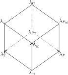

# A Look at Typed Lambda Calculus

This is the second article in our short series on lambda calculus.
You can find the first article [here](https://serokell.io/blog/untyped-lambda-calculus).

We've also [previously covered](https://serokell.io/blog/formal-verification-history) some history of the formal verification and thus type theory.
Reading that article might provide historical background for what we'll be discussing here.

A typed lambda calculus extends untyped lambda calculus with a type system.
The exact features of the type system used can be chosen mostly freely, and we will discuss some common choices in this article.

Since we've discussed untyped lambda calculus in the previous article, now we'll focus more on the applications of type theory.
We'll also assume knowledge of basic lambda calculus syntax and concepts introduced in the previous article.

We'll also assume knowledge of basic lambda calculus syntax and concepts introduced in the previous article: unrestricted computation, logic system, paradox, Russell's type theory, logical consistency.
We also noted that the untyped lambda calculus is hard to use as a logic system due to the paradoxes it creates.
Adding Russell's type theory to lambda calculus makes it, under certain conditions, logically consistent, which in turn makes it possible to mathematically guarantee certain behaviors (or lack thereof).

The most common argument for the strongly-typed languages is that if a program type checks, it will never segfault (or have any other type-related issues), but I think this argument sells typed languages short.
A sufficiently strict and expressive type system allows for encoding much more than simply "not segfaulting".
In some cases, the whole domain can be expressed in types.

In this article, we're concerned with the basics, for the most part, so we won't get too much into the more expressive type systems like System FC or systems with dependent types.

## Lambda calculus with atomic boolean values

We will now introduce atomic values to the lambda calculus.
While it is feasible to construct a value representation using only λ-abstractions (using Church encoding or otherwise) for almost any value we might be interested in, practically speaking, it's not very convenient.

Thus, we introduce atomic values $true$ and $false$.

Since we introduced atomic values, we also need to introduce an eliminator (i.e. a consumer) for these values.
In this case let's consider an $\mathbf{if} \ldots \mathbf{then} \ldots \mathbf{else} \ldots$ operator.

The semantics of this operator should be reasonably familiar to a practicing programmer, but let's informally write them them out anyway:

- $\mathbf{if}\; true\; \mathbf{then}\;\alpha\;\mathbf{else} \;\beta$ should reduce to $\alpha,$
- $\mathbf{if}\; false\; \mathbf{then}\;\alpha\;\mathbf{else} \;\beta$ should reduce to $\beta,$
- $\mathbf{if}\; \gamma\; \mathbf{then}\;\alpha\;\mathbf{else} \;\beta$ where $\gamma$ is a redex, $\gamma$ should be reduced first.

The introduction of the $\mathbf{if}$ operator creates a bit of a kink.
What do we do if $\gamma$ is neither $true$, $false$, nor a redex?
Such terms are called "stuck", the computation, according to our rules, can not proceed.
We want to avoid stuck terms!

To do that, we'll have to place some restrictions on what $\gamma$ could be.

### Typing relations, rules, and systems

To express such restrictions, we introduce the so-called _typing relation_, written as $t : T$, read as "term $t$ has type $T$".
We also introduce _types_, which can be thought of as sets of terms of a certain general form.

Turns out (Reynolds, 1984), this naive interpretation of types as sets doesn't hold to rigorous scrutiny.
Still, it's a good enough mental model unless you're a type theory researcher (and if you are, hi, very nice of you to read this article, please get in touch if you have corrections).

Using typing relations, we thus assign a type to each term.
Rules that we use to assign types are called _typing rules_.
Together, types and typing rules they constitute a _type system_.

Type systems offer a lightweight (i.e. without executing a program) tool to check if a program is "correct" -- in the sense that it doesn't lead to stuck terms.

Typing rules are usually written in the form

$$
\begin{array}{c}
\text{premises} \\
\hline
\text{conclusion}
\end{array}
$$

where $\text{premises}$ is zero or more semicolon-separated typing relations, and $\text{conclusion}$, also often called judgment, is a single typing relation.

If there are no premises, i.e. the conclusion is an axiom, the horizontal line is often omitted.

Let us introduce the type $Bool,$ which represents a set of $true,$ $false,$ and any redexes that eventually evaluate to either.
Now we can write typing relations for our boolean values $true$ and $false$ as axioms:

$$
\begin{array}{lll}
true : Bool & \text{(AxT)} \\
false : Bool & \text{(AxF)}
\end{array}
$$

And for the $\mathbf{if}$ operator:

$$
\begin{array}{cc}
\begin{array}{c}
t_1 : Bool;\quad t_2 : T;\quad t_3 : T \\
\hline
\mathbf{if}\;t_1\;\mathbf{then}\;t_2\;\mathbf{else}\;t_3 : T
\end{array}
& \text{(If)}
\end{array}
$$

Note that rules are annotated with names.
We'll use these names to reference the rules later.

The first two rules, $\text{(AxT)}$ and $\text{(AxF)},$ are trivial.
The third rule, $\text{(If)}$, reads "given that $t_1$ has type $Bool$, and both $t_2$ and $t_3$ have the same arbitrary type $T$, then $\mathbf{if}\;t_1\;\mathbf{then}\;t_2\;\mathbf{else}\;t_3$ has this type $T$".

We should note that the $\text{(If)}$ typing rule will forbid some "correct" terms, as in "terms that aren't stuck".
For example, $\mathbf{if}\;true\;\mathbf{then}\;true\;\mathbf{else}\;(\lambda x.\; x)$ is just $true$, which is arguably perfectly reasonable, but our type system wouldn't allow it.

This is true in general: any sufficiently strict type system will reject some "correct" terms, but that's basically a consequence of Gödel's incompleteness theorems, so either we have to deal with a system that allows for paradoxes (inconsistency), or we have to live with some arguably correct terms being rejected (incompleteness).

In this particular example, it makes sense if you think about it.
The example above is trivial enough, but consider you might have $\mathbf{if}\;\text{<long and hard computation>}\;\mathbf{then}\;true\;\mathbf{else}\;(\lambda x.\; x),$ and this becomes much less clear what the type should be without executing the program.
That is not to say this is a fundamental restriction, more powerful type systems can lift it, but we won't discuss them here.

We call a type system _sound_ if it assigns (relates) a single type to each term.

### Typing lambda-abstractions, variables and applications

We have introduced typing rules for boolean values and $\mathbf{if}$, but there are other terms in our calculus.
Specifically, we also have abstractions, applications, and variables.

Let's start with abstractions.

A lambda-abstraction is basically a function of a single argument.
We could introduce a new simple type $Abs$ and relate all abstractions to this type.
Unfortunately, we would soon run into trouble with this approach.

Indeed, imagine a term $\mathbf{if}\;true\;\mathbf{then}\;(λx.\;true)\;\mathbf{else}\;(λx.\;λy.\;y).$
Both branches would have the type $Abs$, but their behavior is very different.
This example suggests that we need to know both the argument type and the return type of a lambda abstraction.

So instead of a single type, we introduce a family of types $T_1 \to T_2,$ where $\to$ is a _type constructor_.
A type $T \to U$ relates to all functions accepting an argument of type $T$ and returning the result of type $U.$
For the sake of simplicity of notation, we assume $\to$ is right-associative, hence to write the type of an abstraction returning an abstraction, e.g. $T \to (U\to V),$ we don't need parentheses, i.e. $T \to U \to V$.

To decide on the argument type, we basically have two options:

- We can try to "guess" what type it should be based on context. This is inferred typing. Not always possible, though.
- We can demand that the type is specified explicitly. This is explicit typing.

For now, let's go with the second option.
Hence, we need to introduce an explicit typing notation:

$$\lambda x : T. \; \ldots$$

All lambda-abstractions must be explicitly typed like this.

If we know the type of the abstraction argument, we can infer the type of the result by substituting the known type of the variable into the typing rules for the abstraction body.
Formally, this idea is expressed by introducing a _typing context_.

A typing context is a set of typing relations for variables that are "in scope", i.e. relations that are locally known but not necessarily globally true.
Note that variables are _not_ assumed to be identified by their names here: each variable will have a corresponding distinct typing relation in the context even if their names are the same.
Practically speaking, typing context can be thought of as a mapping from variables to types and is often implemented as such.

The "current" context is usually denoted by $\Gamma,$ and is written to the left of other typing relations, separated by $\vdash$ (a symbol for logical entailment).
We can also extend the context by simply adding new comma-separated typing relations, e.g. $\Gamma, x : T$ is the context $\Gamma$, extended by the relation $x:T.$

Using all this new syntax, we can define a typing rule for abstractions now:

$$
\begin{array}{c}
\Gamma, x:T_1 \vdash t : T_2 \\
\hline
\Gamma \vdash \lambda x:T_1.\; t : T_1 \to T_2
\end{array}\quad\text{(Abs)}
$$

This rule simply says that if -- given the current context plus the type of the abstraction variable $T_1$ -- the type of the body turns out to be $T_2$, then the whole abstraction in the current context has type $T_1 \to T_2.$
Pretty straightforward, but the notation may seem a bit arcane.
Spend a minute to understand it, we'll be using it more down the line.

For individual variables, the typing relation would then be rather trivial:

$$
\begin{array}{c}
x : T \in \Gamma \\
\hline
\Gamma \vdash x : T
\end{array}\quad\text{(Var)}
$$

For applications, it's a bit more involved, but hopefully nothing too surprising:

$$
\begin{array}{c}
\Gamma \vdash t_1 : T_1 \to T_2;\quad \Gamma\vdash t_2 : T_1 \\
\hline
\Gamma \vdash t_1\; t_2 : T_2
\end{array}\quad\text{(App)}
$$

Try to interpret this one yourself, then check if you're correct.

Answer

This reads, basically, "for an application expression, if the left-hand side (function) has type $T_1\to T_2,$ and the right-hand-side (argument) has the type $T_1$, then the result of the application will have type $T_2.$

***

To clear up a technicality, we also need to have the context in our $\text{(If)}$ rule, since typings of terms might depend on the context, too:

$$
\begin{array}{cc}
\begin{array}{c}
\Gamma\vdash t_1 : Bool;\quad \Gamma\vdash t_2 : T;\quad \Gamma\vdash t_3 : T \\
\hline
\Gamma\vdash\mathbf{if}\;t_1\;\mathbf{then}\;t_2\;\mathbf{else}\;t_3 : T
\end{array}
& \text{(If)}
\end{array}
$$

### Example

The practical application of these rules is we can use those to assign types to terms and thus ensure the program doesn't get stuck.

To do that, we build typing trees, which just chain typing rules in a tree-like structure.

As a simple example, let us show that term $(\lambda x: Bool.\; x)\;true$ has type $Bool$ in some arbitrary context $\Gamma$.

To build the typing tree, we start with the term in question and find the typing rule where the consequent matches it best.
In this case, this is the $\text{(App)}$ rule:

$$
\begin{array}{c}
\Gamma \vdash t_1 : T_1 \to T_2, t_2 : T_1 \\
\hline
\Gamma \vdash t_1\; t_2 : T_2
\end{array} \quad\text{(App)}
$$

Here we annotate each typing rule with a name for clarity.

We then instantiate all placeholders we can:

$$
\begin{array}{c}
\Gamma \vdash (\lambda x:Bool.\; x) : T_1 \to T_2;\quad \Gamma \vdash true : T_1 \\
\hline
\Gamma \vdash (\lambda x:Bool.\; x)\; true : T_2
\end{array} \quad\text{(App)}
$$

For each condition, we do the same in turn:

$$
\begin{array}{c}
\begin{array}{c}
\begin{array}{c}
x : T_2 \in \Gamma, x:Bool
\\\hline
\Gamma, x:Bool \vdash x : T_2
\end{array}\quad\text{(Var)}
\\\hline
\Gamma \vdash (\lambda x:Bool.\; x) : Bool \to T_2;
\end{array}\begin{array}{c}\\\text{(Abs)}\end{array}
\quad
\begin{array}{c}
\\\\\Gamma \vdash true : Bool
\end{array}\\
\hline
\Gamma \vdash (\lambda x:Bool.\; x)\; true : T_2
\end{array}\quad\begin{array}{c}\\\\\text{(App)}\end{array}
$$

(notice how $T_1$ becomes $Bool$ due to the use of $\text{(Abs)}$ rule)

And finally, we can go the other way, filling up the remaining placeholders:

$$
\begin{array}{c}
\begin{array}{c}
\begin{array}{c}
x : Bool \in \Gamma, x:Bool
\\\hline
\Gamma, x:Bool \vdash x : Bool
\end{array}\quad\text{(Var)}
\\\hline
\Gamma \vdash (\lambda x:Bool.\; x) : Bool \to Bool;
\end{array}\begin{array}{c}\\\text{(Abs)}\end{array}
\quad
\begin{array}{c}
\\\\\Gamma \vdash true : Bool \quad\text{(AxT)}
\end{array}\\
\hline
\Gamma \vdash (\lambda x:Bool.\; x)\; true : Bool
\end{array}\quad\begin{array}{c}\\\\\text{(App)}\end{array}
$$

### The impossibility of simply typed lambda calculus without atomic values

So, we have a sound type system.
However, it does have one pretty obvious drawback.

On the soundness

We will omit the proof of the soundness of the simply typed lambda calculus with atomic booleans, however, it's easy enough to find for the interested reader, e.g. in (Pierce, 2002).

The short sketch is to prove soundness we need to prove two propositions:

1. A typed term can not be stuck, i.e. it is either a value or a computation step is possible.
2. If a typed term is beta-reduced, the result is also a typed term.

Both are proven by structural induction on terms, but you'll also have to formally define the computation semantics, which here we glossed over.

***

In the untyped lambda calculus, we could define

$$id = \lambda x.\; x$$

and use it anywhere we would fancy an identity function.

With our new fancy type system, we can not.
Obviously, for any concrete type, we could define

$$id_{Bool} = \lambda x : Bool.\; x,$$
$$id_{Bool \to Bool} = \lambda x : Bool \to Bool.\; x,$$
$$\ldots$$

But we can't do it in general.

Notice how we need a terminating type in the type signature.
Consequently, if our calculus didn't have any atomic values, i.e. didn't have any types beyond abstractions, we wouldn't be able to specify the argument type.

The reason for this is the lack of polymorphism.

## Polymorphic lambda-calculi

Polymorphism, essentially, is the ability of the type system to represent terms that contain arbitrary types.
Practically speaking, a fully-typed program will not contain any polymorphic types, but its parts, especially during type checking or type inference, might.

We need to distinguish two different kinds of polymorphism (Strachey, 2000):

- _Ad-hoc,_ which defines a common interface for an arbitrary set of individually specified types, and
- _Parametric,_ which allows using abstract symbols in type signatures, representing arbitrary types, instead of concrete types.

Ad-hoc polymorphism is the more common type, and is used extensively in popular programming languages like, say, C++ and such, where it's called "function/method/operator overloading".
Essentially, ad-hoc polymorphism is a way to make a single function (or, more accurately, a single API endpoint) behave differently for different types.
For example, summing integers is pretty different from floating-point numbers, but using a single operator for both is convenient.

Parametric polymorphism is a bit different: it allows us to use so-called _type variables_ in the type signature.
At the use site, type variables are _instantiated_ to concrete types.
The implementation must be the same regardless of the specific instantiation.

Ad-hoc polymorphism is, generally speaking, pretty ad-hoc.
It doesn't have really much of a theoretical background to speak of (but there's an approach to making it less ad-hoc (Wadler, 1989a)).
In contrast, parametric polymorphism does have a strong theoretical foundation.

### Hindley-Milner type system

First, let us discuss the so-called rank-1 polymorphism.

We introduce type variables using the universal quantifier, $\forall.$
The exact place where the variables are introduced matters.
In particular, rank-1 polymorphism allows the universal quantifier only on the top level of types.
Practically, this means that $\forall \alpha.\;\alpha \to \alpha$ is okay, but $\forall \beta.\;(\forall \alpha.\;\alpha \to \alpha)\to \beta \to \beta$ is not.

There's an argument to be made about how $Bool\to (\forall \alpha.\; \alpha \to Bool)$ is _practically_ rank-1 polymorphic as it is isomorphic to $\forall \alpha.\;Bool\to \alpha \to Bool,$ but we'll gloss over this point here.

Rank-1 polymorphic type system with type inference is first described by Roger Hindley in (Hindley, 1969), and later rediscovered by Robin Milner in (Milner, 1978).
A formal analysis and correctness proof was later performed by Luis Damas in (Damas, 1982).
This type system is called the Damas-Hindley-Milner type system, or more commonly the Hindley-Milner type system.
We will call it HM below.

HM (usually with many extensions) is used as a base for many functional languages, including ML (by the way invented by Robin Milner) and Haskell.

On Haskell's type system

I say HM is used as a base for Haskell.
This is on some technical level correct, but I feel a deluge of "uh, actually" coming, so I'll get this out of the way.
For a while, Haskell used a variation of System Fω at the back end, at some point switching to System FC, while on the front end both Haskell98 and Haskell2010 use a variation on HM with type classes and monomorphism restriction.
If we include various GHC extensions, things quickly get very complicated, but at the core, it's still somewhat similar to HM.

***

#### Let-polymorphism

HM makes one concession for the sake of type inference.
It only allows so-called let-polymorphism instead of unconstrained parametric polymorphism.

To explain what this means with an example: one would like to have polymorphic type inference for expressions like

$$(\lambda id.\; \ldots (id\;true) \ldots (id\;123) \ldots)\;(\lambda x.\; x),$$

but type inference in polymorphic lambda calculus is in general undecidable (Wells, 1999).

To work around that, HM stipulates that polymorphic types can only be inferred for let-bindings, e.g. bindings of the form

$$
\begin{array}{rl}
\mathbf{let} & id = \lambda x.\; x\\
\mathbf{in} & \ldots (id\;true) \ldots (id\;123) \ldots
\end{array}
$$

Obviously, HM has to introduce the let-binding construction into lambda calculus syntax and define its semantics in terms of base lambda calculus.
Hopefully, the translation is more or less obvious -- let-bindings are semantically equivalent to immediately-applied lambda abstractions.
Note, however, that this doesn't yet allow for recursive definitions.

#### HM syntax

I will now formally introduce the syntax of expressions, types, and a function $free$ acting on type expressions.
I'll use an informal variation of BNF (Backus-Naur form) to define syntax.

The expression syntax is exactly the syntax of lambda calculus plus the let-in construct:

$$
\begin{array}{rrll}
t & ::= & x & \text{variable}
\\ & | & t_1\;t_2 & \text{application}
\\ & | & \lambda x.\; t & \text{abstraction}
\\ & | & \mathbf{let}\; x = t_1\;\mathbf{in}\;t_2 & \text{let-in}
\end{array}
$$

Note that $t$, $t_1$, $t_2$ are recursive references.

Types are introduced in two parts, the first part being the _monotypes_ $\tau$ and the second -- _polytypes_ $\sigma$ (also called _type schemes_, hence the $\sigma$):

$$
\begin{array}{rrll}
\tau & ::= & \alpha & \text{type variable}
\\ & | & C\;\tau_1\;\ldots\;\tau_n & \text{type constructor application}
\\\sigma & ::= & \tau & \text{monotype}
\\ & | & \forall \alpha .\; \sigma & \text{quantified type}
\end{array}
$$

$C$ represents type constructors, defined as primitives, and their set is arbitrary in HM, but it must include at least the abstraction type constructor $\to$.

Parentheses can be used in value and type expressions to change evaluation order, but we omit these in the syntax definitions for brevity.

Note that type variables are admitted as monotypes, which makes those distinct from _monomorphic types_ that can't have type variables.

Polytypes also include monotypes, in addition to quantified types.

The quantifier $\forall$ _binds_ the type variables, so in a type expression $\forall \alpha_1\;\ldots\;\alpha_n.\; \tau,$ all of $\alpha_i$ are _bound_.
Type variables that are not bound are called _free_.

Additionally, type variables may be bound by the typing context.
The reason for this addition is nested let-bindings.

We also need a function $free$ to define typing rules.
$free$ collects all free variables in a type expression.
It is defined as follows:

$$
\begin{array}{lcl}
free(\alpha) & = & \{\alpha\} \\
free(C\;\tau_1\;\ldots\;\tau_n) & = & \bigcup\limits_{i=1}^n free(\tau_i) \\
free(\Gamma) & = & \bigcup\limits_{x:\sigma \in \Gamma} free(\sigma) \\
free(\forall \alpha.\; \sigma) & = & free(\sigma) - \{\alpha\} \\
free(\Gamma \vdash e:\sigma) & = & free(\sigma) - free(\Gamma) \\
\end{array}
$$

If a type variable occurs unbound in a typing, it is implicitly treated as universally quantified.

#### The principal type

Polymorphism implies that the same term can have more than one type.
In fact, it could have infinitely many types, as is the case with $\lambda x.\; x.$

For the type system to be sound, we need to somehow choose the "most best" type out of all possibilities.
Thankfully, there is a straightforward way to do so.

The idea is to choose the largest most general type, also called the principal type -- that is, the most specific polytype that can still produce any other possible type via bound variable substitution.
We denote substitution of a type variable $\alpha$ for a monotype $\tau$ in an expression $e$ as $\{\alpha \mapsto \tau\}e.$

If some type $\tau'$ can be produced from $\tau$ by substitution, it is said that $\tau$ is more general than $\tau',$ written as $\tau \sqsubseteq \tau'.$
$\sqsubseteq$ defines a partial order on types.
Note that the more general type is "smaller" than the less general type.
This is a feature of treating types as sets: the more general the type, the fewer possible values it can have.
The most general type $\forall\alpha.\;\alpha$ is usually considered uninhabited (with a few caveats), i.e. it has no values at all.

Formally, this all can be expressed by the following rule (called specialization rule):

$$
\begin{array}{c}
\beta_i \notin free(\forall\alpha_1\ldots\alpha_n.\;\tau) \\
\hline
\forall\alpha_1\ldots\alpha_n.\;\tau
\sqsubseteq \forall\beta_1\ldots\beta_m.\;\{\alpha_i\mapsto\tau_i\}\tau
\end{array}
$$

This rule essentially says that a more general type can be made less general by substitution.
The $\beta_i \notin free(\forall\alpha_1\ldots\alpha_n.\;\tau)$ condition ensures that unbound variables are not accidentally replaced and are treated as constants.

#### Typing rules

The complete HM ruleset is as follows:

$$
\begin{array}{cl}
\begin{array}{c}x:\sigma\in\Gamma\\\hline \Gamma\vdash x:\sigma\end{array} & \text{variable} \\
\begin{array}{c}\Gamma\vdash t_0:\tau\to\tau';\quad\Gamma\vdash t_1:\tau\\\hline \Gamma\vdash t_0\;t_1:\tau'\end{array} & \text{application} \\
\begin{array}{c}\Gamma,\;x:\tau\vdash t:\tau'\\\hline \Gamma\vdash \lambda x.\; t:\tau\to\tau'\end{array} & \text{abstraction} \\
\begin{array}{c}\Gamma\vdash t_0:\sigma;\quad\Gamma,\;x:\sigma\vdash t_1:\tau\\\hline \Gamma\vdash \mathbf{let}\;x = t_0\;\mathbf{in}\; t_1 : \tau\end{array} & \text{let-in} \\
\begin{array}{c}\Gamma\vdash t:\sigma';\quad\sigma'\sqsubseteq\sigma\\\hline \Gamma\vdash t : \sigma\end{array} & \text{instantiation} \\
\begin{array}{c}\Gamma\vdash t:\sigma;\quad\alpha\notin free(\Gamma)\\\hline \Gamma\vdash t : \forall \alpha.\;\sigma\end{array} & \text{generalization} \\
\end{array}
$$

This is just one possible formulation of the ruleset.
Other equivalent formulations exist, but this one is enough for our purposes for now.

Variable, application, and abstraction rules should already look somewhat familiar -- indeed, those are almost exactly the same as those in simply typed lambda calculus.
One notable feature is that the variable rule allows variables to have polytypes, while application and abstraction do not.
This, together with the let-in rule, enforces the rule that only let-in bindings are inferred as polymorphic.

The let-in rule is unsurprisingly similar to the abstraction rule.
The only difference is it uses the polytype $\sigma$ instead of the monotype $\tau.$

The last two rules deserve a bit of a closer look.

The instantiation rule says that if a given expression $t$ has a general type $\sigma'$ in context, it can be specialized to a less general type $\sigma,$ as defined in the previous subsection.
This rule ensures we can in fact use $id : \forall\alpha.\;\alpha\to\alpha$ in any matching context, e.g. $Bool\to Bool.$

On the other hand, the generalization rule works kind of in reverse: it adds a universal quantifier to a polytype.
The idea here is that an implicit quantification in $\Gamma\vdash t:\sigma$ can be made explicit if the type variable in question $\alpha$ does not appear free in the context.
The consequence of this rule is that variables that end up free in a typing relation are implicitly universally quantified.

#### Recursive bindings

In the discussion so far, we glossed over recursive bindings.

The original paper mentions recursion can be implemented using the fixed-point combinator $fix$.
Its semantics are pretty much the same as in untyped lambda calculus, and its type is
$$fix : \forall\alpha.\;(\alpha\to\alpha)\to\alpha.$$
Note that this combinator can not be defined (or rather, typed) in terms of HM, so it has to be introduced as a built-in primitive.

Then, the syntactical form for recursive bindings can be introduced as a syntactic sugar:
$$\mathbf{rec}\;v = t_1\;\mathbf{in}\;t_2 \equiv
\mathbf{let}\;v = fix\;(\lambda v.\;t_1)\;\mathbf{in}\;t_2$$

Alternatively, an extension to the typing ruleset with the same semantics is possible.

This is all rather straightforward, but it comes at a price.
With the introduction of $fix,$ non-terminating terms can be formulated, which otherwise isn't the case.

For example, the term $fix\;id : \forall\alpha.\;\alpha$ is a non-terminating computation.

Additionally, as evidenced above, $\forall\alpha.\;\alpha$ becomes inhabited.
This introduces various logical consistency issues, which are not usually an issue for a general-purpose programming language but are an issue for a theorem prover.

However, without $fix$, general recursion is not possible, which makes the calculus strictly less powerful than a Turing machine.

Hence, a choice has to be made either in favor of logical correctness or computational power.

### System F

Hindley-Milner type system is nice in that it can infer types, but it is somewhat restrictive due to only supporting let-polymorphism.

One somewhat annoying feature is that, as discussed above, Hindley-Milner can not type the following term:
$$\lambda\;id.\; pair\; (id\; true)\; (id\; 4)$$

This comes down to type inference for higher-rank polymorphism being undecidable, but this issue is readily alleviated by explicit type signatures.

System F, independently discovered by Jean-Yves Girard (Girard, 1972) and John Reynolds (Reynolds, 1974), also called polymorphic lambda calculus or second-order lambda calculus is a generalization of Hindley-Milner type system to arbitrary-rank polymorphism.

System F, unlike Hindley-Milner, formalizes parametric polymorphism explicitly in the calculus itself, introducing value-level lambda-abstractions over _types_.
This essentially makes specialization explicit.

We will sketch the basics of System F here but won't get into any detail.
An interested reader is highly encouraged to look into (Pierce, 2002).

The primary new syntactical form introduced in F is the abstraction over types, denoted with a capital lambda: $\Lambda\alpha.\; t$

Typing rules are that of simply typed lambda calculus with the addition of

$$
\begin{array}{cl}
\begin{array}{c}
\Gamma\vdash t:\forall\alpha.\;\sigma\\
\hline
\Gamma\vdash t\;\tau:\{\alpha\mapsto\tau\}\sigma
\end{array} & \text{type application} \\
\begin{array}{c}
\Gamma\vdash t:\sigma;\quad\alpha\notin free(\Gamma)\\
\hline
\Gamma\vdash \Lambda\alpha.\;t : \forall\alpha.\;\sigma
\end{array} & \text{type abstraction}
\end{array}
$$

(compare with instantiation and generalization rules in HM)

Hence, assuming
$pair : \forall\alpha.\;\forall\beta.\;\alpha\to\beta\to Pair\;\alpha\;\beta,$
the motivating example would be typed roughly as
$$(\forall\alpha.\; \alpha\to\alpha)\to Pair\;Bool\;Int,$$
and its actual implementation would use type applications explicitly, i.e.
$$\lambda\;id.\; pair\;Bool\;Int\; (id\;Bool\;true)\; (id\;Int\;4)$$

In practical applications (like Haskell with `RankNTypes` extension), these explicit applications are inferred from type signatures (and thus made implicit).
They can also be made explicit with the `TypeApplications` extension.

## The lambda cube

With System F, we've introduced the concept of _terms depending on types_ via the type abstraction.

A natural question that might come from this is, what other kinds of dependencies might we introduce?
Dependence of terms on terms is a given since it's a feature of untyped lambda calculus.
But we can have dependence of terms upon types, types upon terms, and types upon types.
Essentially, we have three axes, so this whole variant space constitutes, topologically speaking, a cube.

Behold, the lambda cube:

Going directly up in the picture introduces dependence of types upon types, i.e. user-defined type constructors.
Going left introduces dependence of terms upon types, i.e. System F style polymorphism.
Going right introduces dependence of types upon terms, i.e. Martin-Löf style dependent types.

Thus, we have the following variations:

| | term ← type | type ← type | type ← term |
|-------------------------------|:-:|:-:|:-:|
| $\lambda_\to$                 |   |   |   |
| $\lambda_2$                   | × |   |   |
| $\lambda_{\underline\omega}$  |   | × |   |
| $\lambda_P$                   |   |   | × |
| $\lambda_\omega$              | × | × |   |
| $\lambda_{P2}$                | × |   | × |
| $\lambda_{P\underline\omega}$ |   | × | × |
| $\lambda_C$                   | × | × | × |

The left arrow ← denotes "depends on".

The lambda cube was introduced by Henk Barendregt in (Barendregt, 1991) to investigate different generalizations of simply-typed lambda calculus (here denoted as $\lambda_\to$).

Let us briefly discuss some of the options.

$\lambda_2$ is System F, discussed above.

$\lambda_\omega$ is System Fω.
It extends System F with type operators and is a different, much more complex system.
In short, System Fω allows defining type constructors inside the calculus itself instead of considering those as primitives, i.e. allows for user-defined types.

$\lambda_{\underline\omega}$, a.k.a. System F<u>ω</u> is System Fω without type abstraction/application, or simply typed lambda calculus with user-defined types.

$\lambda_P$ is simply typed lambda calculus with dependent types.

$\lambda_C$, a.k.a. $\lambda_{P\omega},$ is the calculus of constructions (Coquand, 1986), famously used as the basis for the Coq proof assistant, but also with other dependently-typed languages.
Here, the border between terms and types is virtually gone.

We will not discuss these advanced type systems in any more detail here, but I thought I should at least mention them.

## Conclusions

The topic of type theory is rather vast, so it's infeasible to cover it in a single blog article in any considerable detail.

Hopefully, I've introduced enough basics here so that an interested reader can continue exploring this topic on their own, and mentioned enough topics for further reading.

So let's briefly review what we covered.

- We learned the basic conventions and syntax of the type theory (or at least its modern style) on the example of simply explicitly typed lambda calculus with atomic booleans.
- We then discussed the Hindley-Milner type system for rank-1 polymorphic lambda calculus in some detail.
- We also discussed how unbound recursion makes Hindley-Milner type logics inconsistent.
- Then we briefly discussed System F, which is a generalization of the Hindley-Milner type system (or rather, vice versa, HM is a constrained version of System F)
- System F being one possible extension of simply typed lambda calculus, we also very briefly mentioned other possible extensions, including dependently typed ones using the model of the lambda cube.

## Exercises

1. Using the framework of simply typed lambda calculus with atomic booleans, show (by building typing trees) that given terms have stated types:

    - $f: Bool \to Bool \vdash f\; (\mathbf{if}\; false\; \mathbf{then}\; true\; \mathbf{else}\; false) : Bool$
    - $f: Bool \to Bool \vdash \lambda x:Bool.\; f\; (\mathbf{if}\;x\;\mathbf{then}\; false\; \mathbf{else}\; x) : Bool \to Bool$

2. Using the framework of simply typed lambda calculus with atomic booleans, find some context $\Gamma,$ given which the term $f\;x\;y$ has the type $Bool.$ Is it possible to describe all such contexts in simply-typed lambda calculus?

3. How would you describe all contexts from exercise 2 in the Hindley-Milner type system?

4. Implement a simply typed lambda calculus type checker and interpreter in your favorite programming language. Likely easier to start from an untyped lambda calculus interpreter, then introduce atomic values and types. See the previous article for hints on implementing the former. Feel free to add more atomic types than just $Bool$.

## References

(Barendregt, 1991) Barendregt, Henk. "Introduction to generalized type systems." Journal of functional programming 1, no. 2 (1991): 125-154.

(Coquand, 1986) Coquand, T., & Huet, G. (1986). The calculus of constructions (Doctoral dissertation, INRIA).

(Damas, 1982) Damas, Luis, and Robin Milner. "Principal type-schemes for functional programs." In Proceedings of the 9th ACM SIGPLAN-SIGACT symposium on Principles of programming languages, pp. 207-212. 1982.

(Girard, 1972) Girard, Jean-Yves. "Interprétation fonctionnelle et élimination des coupures de l'arithmétique d'ordre supérieur." PhD diss., Éditeur inconnu, 1972.

(Hindley, 1969) Hindley, Roger. "The principal type-scheme of an object in combinatory logic." Transactions of the american mathematical society 146 (1969): 29-60.

(Milner, 1978) Milner, Robin. "A theory of type polymorphism in programming." Journal of computer and system sciences 17.3 (1978): 348-375.

(Pierce, 2002) Pierce, Benjamin C. Types and programming languages. MIT press, 2002.

(Reynolds, 1974) Reynolds, John C. "Towards a theory of type structure." In Programming Symposium, pp. 408-425. Springer, Berlin, Heidelberg, 1974.

(Reynolds, 1984) Reynolds, John C. "Polymorphism is not set-theoretic." In International Symposium on Semantics of Data Types, pp. 145-156. Springer, Berlin, Heidelberg, 1984.

(Strachey, 2000) Strachey, Christopher. "Fundamental concepts in programming languages." Higher-order and symbolic computation 13.1 (2000): 11-49.

(Wadler, 1989a) Wadler, Philip, and Stephen Blott. "How to make ad-hoc polymorphism less ad hoc." In Proceedings of the 16th ACM SIGPLAN-SIGACT symposium on Principles of programming languages, pp. 60-76. 1989.

(Wells, 1999) Wells, Joe B. "Typability and type checking in System F are equivalent and undecidable." Annals of Pure and Applied Logic 98.1-3 (1999): 111-156.
