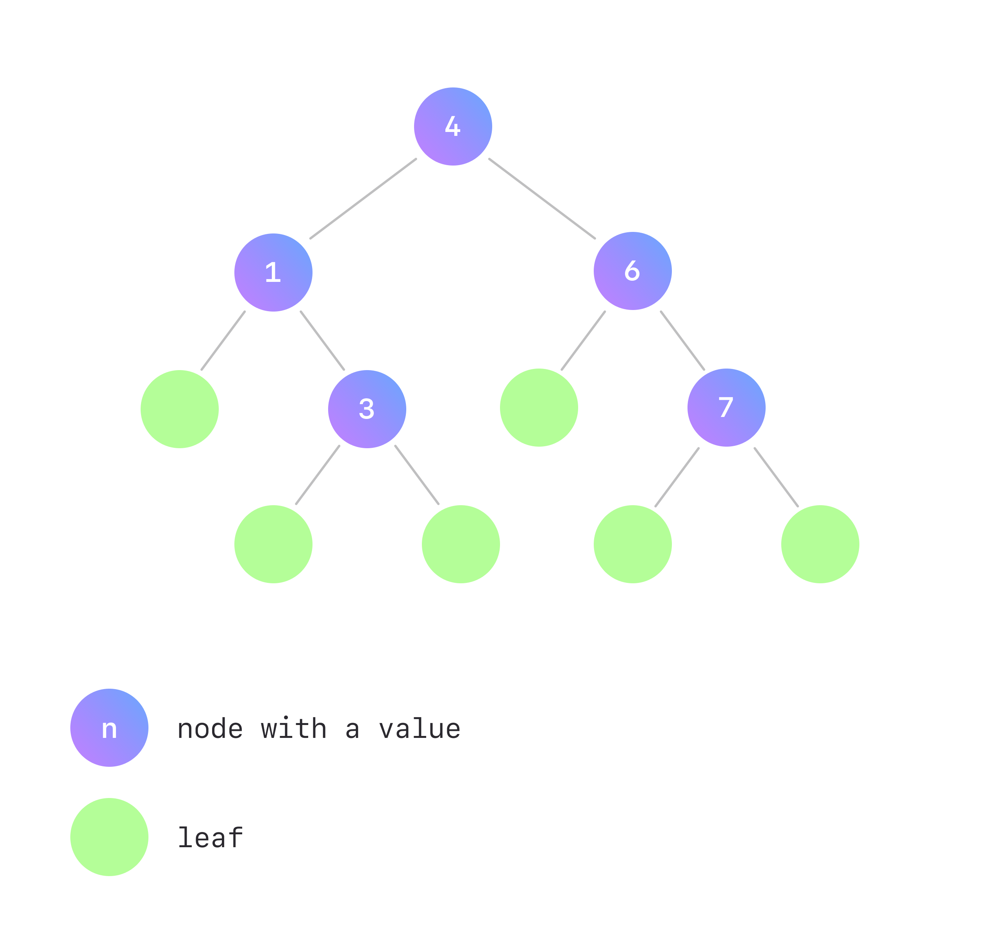

# What's That Typeclass: `Foldable`?

There is a function `reduce` in programming languages, which is appliable to some containers. It goes element by element, applying a given binary function and keeping the current result as an accumulator, finally returning the value of the accumulator as a summary value of the container. 

For example, in Python:

```python
> reduce(lambda acc, elem: acc + elem, [1, 2, 3, 4, 5]) # addition of elements in a list
15
```

Haskell, in turn, has two fundamental functions representing reducing, or, as we call it, folding — `foldl` and `foldr` — that differ in the order of the folding. `foldl` reduces elements of a container from left to right (as `reduce` in other languages usually does), while `foldr` reduces from right to left.

These two functions are core methods of the `Foldable` type class, about which we are going to learn in this article.

## `foldr` and `foldl` for a list

To start, let's figure out what `foldr` and `foldl` are for a list. Consider the following type signatures:

```haskell
foldr :: (a -> b -> b) -> b -> [a] -> b
foldl :: (b -> a -> b) -> b -> [a] -> b
```

The `foldr` signature corresponds to the function folding the list from right to left. It takes a function `f` of type `a -> b -> b` as the first argument, an initial (or base) value `z` of type `b` as the second argument, and a list `xs = [x₁, x₂, ..., xₙ]` of type `[a]` as the third one. Let's introduce an accumulator `acc` which is equal to `z` initially. First, `f` is applied to the last element of the list and a base element `z`, the result of which is written in an accumulator — ``xₙ `f` z``. Then `f` is applied to the second-to-last element of the list and the current value of the accumulator — ``xₙ₋₁ `f` (xₙ `f` z)``. After going through all the elements of the list, `foldr` returns the  accumulator as a summary value, which finally equals to ``x₁ `f` (x₂ `f` ... (xₙ₋₁ `f` (xₙ `f` z)) ... )``. 

```haskell
acc = z
acc = xₙ `f` z
acc = xₙ₋₁ `f` (xₙ `f` z)
...
acc = x₁ `f` (x₂ `f` ( ... (xₙ₋₁ `f` (xₙ `f` z)) ... )
```

This process could be presented as a picture:


Unlike `foldr`, `foldl` performs left-to-right folding of a list. Therefore, `f` is applied to `z` and `x₁` first — ``acc = z `f` x1`` — then `f` is applied to a current value of an accumulator and `x₂` — ``acc = (z `f` x₁) `f` x₂`` — and so on. Finally, `foldl` returns ``acc = ( ... ((z `f` x₁) `f` x₂) `f` ... xₙ₋₁) `f` xₙ``. 

```markdown
acc = z
acc = z `f` x₁
acc = (z `f` x₁) `f` x₂
...
acc = ( ... (z `f` x₁) `f` x₂) `f` ...) `f` xₙ₋₁) `f` xₙ
```

The corresponding illustration of these operations:


### Haskell definition

The recursive Haskell definition of `foldr` is the following:

```haskell
instance Foldable [] where
  foldr :: (a -> b -> b) -> b -> [a] -> b
  foldr _ z []     =  z
  foldr f z (x:xs) =  x `f` foldr f z xs
```

## `foldr` and `foldl` simple examples

Let's consider a couple of simple examples of applying `foldr` and `foldl` to a list:

```haskell
-- addition
ghci> foldr (+) 0 [1, 2, 3] -- 1 + (2 + (3 + 0))
6
ghci> foldl (+) 0 [1, 2, 3] -- ((0 + 1) + 2) + 3
6

-- exponentiation
ghci> foldr (^) 2 [2, 3] -- 2 ^ (3 ^ 2)
512
ghci> foldl (^) 2 [2, 3] -- (2 ^ 2) ^ 3
64
```

It doesn't matter to the addition if the folding is right-to-left or left-to-right as it's an associative operator. However, when folding with exponentiation operator, the order is significant.

## Generalization of `foldr` and `foldl`

Fortunately, it's possible to fold not only lists! We can implement the instance of `Foldable` whenever a data type has one type argument, in other words, when its [kind](https://wiki.haskell.org/index.php?title=Kind&oldid=62154) is `* -> *`. To figure out the kind of Haskell data type, you can write `:kind` (or simply `:k`) in GHCi. To display the type of Haskell expression, use `:type` (or `:t`).

For instance, a list has one type argument — the type of the list's elements:

```haskell
ghci> :kind []
[] :: * -> *

ghci> :type [1 :: Int, 2, 3]
[1, 2, 3] :: [Int]
ghci> :type ['a', 'b']
['a', 'b'] :: [Char]
```

`Maybe a` data type also has one type argument — the type of presented value:

```haskell
ghci> :kind Maybe
Maybe :: * -> *

ghci> :type Just (2 :: Int)
Just 2 :: Maybe Int
ghci> :type Just "abc"
Just "abc" :: Maybe [Char]
ghci> :type Nothing
Nothing :: Maybe a -- can't decide what type `a` is
```

`Int` and `String` have no type arguments, and you obviously can't fold them:

```haskell
ghci> :kind Int
Int :: *
ghci> :type (1 :: Int)
1 :: Int

ghci> :kind String
String :: *
ghci> :type ""
"" :: [Char]
ghci> :type "ab"
"ab" :: [Char]
```

`Either a b` data type has two type arguments corresponding to `Left` and `Right` values, so there is also no reasonable way to fold an `Either a b`. But we could define `instance Foldable (Either a)` since `Either a` has an appropriate `* -> *` kind. The same for the pair data type — `instance Foldable ((,) a)` is possible. However, such instances are not intuitive since they operate on only one of type arguments.

```haskell
ghci> :kind Either
Either :: * -> * -> *

ghci> :type Left (1 :: Int)
Left 1 :: Either Int b -- can't decide what type argument `b` is
ghci> :type Right 'a'
Right 'a' :: Either a Char -- can't decide what type argument `a` is

ghci> :kind Either Int
Either Int :: * -> *
ghci> :kind (,) Char
(,) Char :: * -> *
```

For those data types which could have `Foldable` instance, generalized versions of `foldr` and `foldl` have the following type signatures:

```haskell
foldr :: Foldable t => (a -> b -> b) -> b -> t a -> b
foldl :: Foldable t => (b -> a -> b) -> b -> t a -> b
```

### Some instances as an example

#### `Maybe a`

Let's take a look at other instances of `Foldable`. One easy-to-understand but not really useful example is `Maybe a`'s instance. Folding `Nothing` returns a base element, and reducing `Just x` with `foldr f z` (or `foldl f z`) is applying `f` to `x` and `z`:

```haskell
instance Foldable Maybe where
  foldr :: (a -> b -> b) -> b -> Maybe a -> b
  foldr _ z Nothing  = z
  foldr f z (Just x) = f x z
```

Usage examples:

```haskell
ghci> foldr (+) 1 (Just 2)
3
ghci> foldr (+) 1 Nothing
1
```

#### `BinarySearchTree a`

A more interesting and useable `Foldable` instance could be defined for a `BinarySearchTree a` data type. Consider [a binary search tree](https://en.wikipedia.org/w/index.php?title=Binary_search_tree&oldid=1053783914), each node of which either stores a value of type `a` and has left and right subtrees, or is just a leaf without a value. Moreover, for each non-leaf node `n`, all values in its left subtree should be less or equal than the `n`'s value, and all values in its right subtree should be greater than the `n`'s value. 



This structure matches the following Haskell definition:

```haskell
data BinarySearchTree a
  = Branch (BinarySearchTree a) a (BinarySearchTree a)
  | Leaf
```

Imagine that we want to reduce the whole tree to just one value. We could sum values of nodes, multiply them, or perform any other binary operation. So,it's reasonable to define a folding function that matches your goals. We suggest you try to implement `Foldable` instance on your own; it's one of the exercises below. Take into account that to define `foldr`, we need to go through the tree's elements from right to left — from right subtree to left subtree through the non-leaf node connecting them.

## Minimal Complete Definition of `Foldable` typeclass

### `foldMap`

The next important method of `Foldable` is `foldMap`. It has the following declaration:

```haskell
foldMap :: (Monoid m, Foldable t) => (a -> m) -> t a -> m
```

It's important to note that `foldMap` has a [`Monoid`](https://hackage.haskell.org/package/base-4.16.0.0/docs/Prelude.html#t:Monoid) constraint. Its first argument is a function that maps each element of a container into a monoid, the second argument is a container itself. After mapping elements, the results are combined using `(<>)` operator. The order of folding is from right to left, so `foldMap` could be implemented via `foldr`. 

Let's look at how exactly that could be done:

```haskell
foldMap :: (Monoid m, Foldable t) => (a -> m) -> t a -> m
foldMap f = foldr (\x acc -> f x <> acc) mempty
```

`foldMap` doesn't have a base element, as only the elements of a container are reduced. However, `foldr` does, so it perfectly makes sense to use the identity of monoid — `mempty`. We can also see that the folding function `f` is composed with `(<>)`, thus, the current result is appended to a monoid accumulator on each step.

### Minimal Complete Definition

We have already shown how `foldMap` is implemented using `foldr`. It's not obvious, but `foldr` could also be implemented via `foldMap`! It's off-topic for this article, therefore, please proceed to [the documentation](https://hackage.haskell.org/package/base-4.16.0.0/docs/src/Data.Foldable.html#foldr) for the details. Consequently, to create the `Foldable` instance, you cab provide a definition of either `foldr` or `foldMap`, which is exactly the Minimal Complete Definition — `foldMap | foldr`. Note that you shouldn't implement `foldMap` in terms of `foldr` and simultaneously `foldr` in terms of `foldMap` as this will just loop forever. Thus, you implement one of them, and Haskell provides the definitions of all `Foldable`'s methods automatically.

## Other methods of `Foldable` and things to be careful about when using the type class

`foldl`, `foldr`, and `foldMap` could be considered the core for understanding the nature of `Foldable`. Nonetheless, there are others which are worth mentioning.

### Strict `foldl'`

Haskell uses lazy evaluations by default, and it can have a positive effect on performance in a lot of cases. Although, the laziness might also impact it negatively sometimes, and folding is exactly this case. Imagine that you want to sum up the elements in a really huge list. When using `foldl` or `foldr`, a value of an accumulator isn't evaluated on each step, so a [thunk](https://wiki.haskell.org/Thunk) is accumulated. Considering `foldl`, in the first step the thunk is just ``z `f` x₁``, in the second — ``(z `f` x₁) `f` x₂``, that's not a big deal. But in the final step, an accumulator stores ``( ... (z `f` x₁) `f` x₂) `f` ...) `f` xₙ₋₁) `f` xₙ``. If the list's length is above ~10^8, the thunk becomes too large to store it in a memory, and we get `** Exception: stack overflow`. However, that's not the reason to drop Haskell since we have `foldl'`!

`foldl'` enforces [weak head normal form](https://wiki.haskell.org/Weak_head_normal_form) in each step, thus preventing a thunk from being accumulated. So `foldl'` is often a desirable way to reduce a container, especially when it's large, and you want a final strict result.

Here are some "benchmarks" that may vary depending on a computer's characteristics. But they are illustrative enough to grasp the difference between the performance of strict and lazy fold.

```haskell
-- set GHCi option to show time and memory consuming
ghci> :set +s

-- lazy `foldl` and `foldr`, length = 10^7
ghci> foldl (+) 0 [1..10000000] 
50000005000000
(1.97 secs, 1,612,359,432 bytes)

ghci> foldr (+) 0 [1..10000000] 
50000005000000
(1.50 secs, 1,615,360,800 bytes)

-- lazy `foldl` and `foldr`, length = 10^8
ghci> foldl (+) 0 [1..100000000]
*** Exception: stack overflow

ghci> foldr (+) 0 [1..100000000]
*** Exception: stack overflow

-- strict `foldl'`, length = 10^8..10^10
ghci> foldl' (+) 0 [1..100000000]
5000000050000000
(1.43 secs, 8,800,060,520 bytes)

ghci> foldl' (+) 0 [1..1000000000]
500000000500000000
(15.28 secs, 88,000,061,896 bytes)

ghci> foldl' (+) 0 [1..10000000000]
50000000005000000000
(263.51 secs, 1,139,609,364,240 bytes)
```

### Others

There are other methods of `Foldable` type class that can be helpful sometimes. For example, there is a `fold` that reduces a container of `Monoid`s using the `(<>)` function. `foldl1` and `foldr1`, which should be used with non-empty containers only. The `length` function, which you might know, is also a member of the `Foldable`, along with `maximum`, `minimum`, and `null`. You might proceed to [the documentation](https://hackage.haskell.org/package/base-4.16.0.0/docs/Data-Foldable.html) to get to know them better.


## Exercises

The theoretical part of our article is over. We hope you know what `Foldable` is now! We suggest you to try out your new knowledge with our mini exercises.

1. Which definition is correct? 

    ```haskell
    foldr (\s rest -> rest + length s) 0 ["aaa", "bbb", "s"]
    foldr (\rest s -> rest + length s) 0 ["aaa", "bbb", "s"]
    ```

    <details>
      <summary>Answer</summary>

    The first definition is correct. Recall the type signature of the `foldr`'s first argument — `a -> b -> b`. `a` type here corresponds to the type of container, `b` type, in turn, is the type of an accumulator. In this example, the length of a current string is added to the accumulator in each step, so `s` matches the current element which has the type of a container — `a`.
    </details>

2. Implement `foldl` recursively

    Hint: look at the [`foldr` definition](#haskell-definition) above.

    <details>
      <summary>Solution</summary>

    ```haskell
    foldl :: (b -> a -> b) -> b -> [a] -> b
    foldl _ z []     =  z
    foldl f z (x:xs) =  foldl f (z `f` x) xs
    ```
    </details>

3. Implement `foldr` for the `BinarySearchTree a`

    Bear in mind that to allow type signature in instance definition, you need to use the [`InstanceSigs` extension](https://ghc.gitlab.haskell.org/ghc/doc/users_guide/exts/instances.html#extension-InstanceSigs).

    Expected behaviour:
    ```haskell
    -- Binary search tree from the example picture above
    ghci> binarySearchTree = Branch (Branch Leaf 1 (Branch Leaf 3 Leaf)) 4 (Branch Leaf 6 (Branch Leaf 7 Leaf))

    ghci> foldr (+) 0 binarySearchTree
    21
    ghci> foldr (-) 0 binarySearchTree
    3
    ghci> foldl (-) 0 binarySearchTree
    -21
    ```
    
    <details>
      <summary>Solution</summary>
    
    ```haskell
    instance Foldable BinarySearchTree where
      foldr :: (a -> b -> b) -> b -> BinarySearchTree a     -> b
      foldr _ z Leaf                     = z
      foldr f z (Branch left node right) = foldr f     (node `f` foldr f z right) left
    ```
    </details>

4. Implement a `reverse` function for lists via `foldl`

    Expected behaviour:
    ```haskell
    ghci> reverse [1, 2, 3]
    [3, 2, 1]
    ```
    
    <details>
      <summary>Solution</summary>
    
    ```haskell
    reverse :: [a] -> [a]
    reverse = foldl (\acc x -> x:acc) []
    ```
    </details>
    
5. Implement a `prefixes` function for lists via `foldr`

    Expected behaviour:
    ```haskell
    ghci> prefixes [1, 2, 3]
    [[1], [1, 2], [1, 2, 3]]
    
    ghci> prefixes []
    []
    ```
    
    <details>
      <summary>Solution</summary>
    
    ```haskell
    prefixes :: [a] -> [[a]]
    prefixes = foldr (\x acc -> [x] : (map (x :) acc)) []
    ```
    </details>

Thank you for reading! If you would like to read more Haskell articles like these, be sure to follow us on [Twitter](https://twitter.com/serokell) or [Dev](https://dev.to/serokell). You can also subscribe to our newsletter below to receive new Haskell articles straight in your email inbox. 
